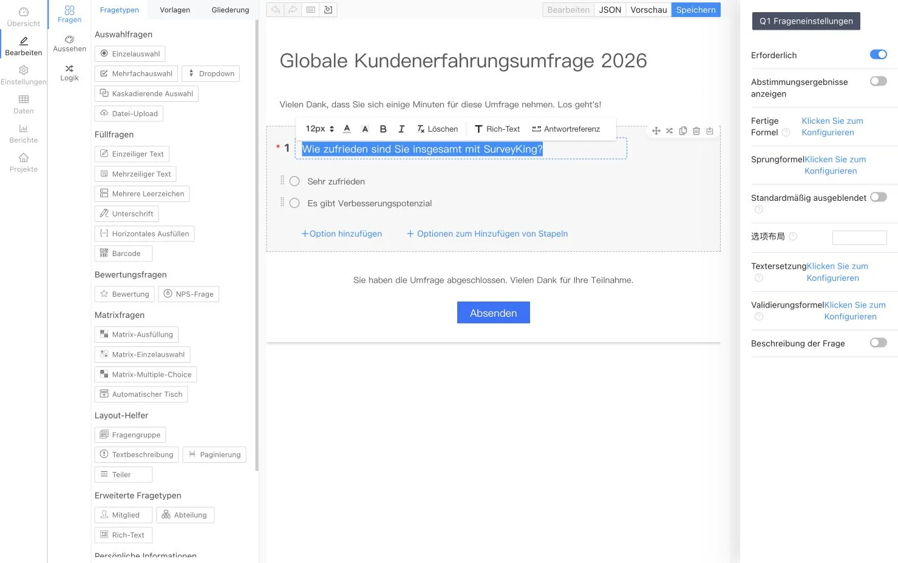
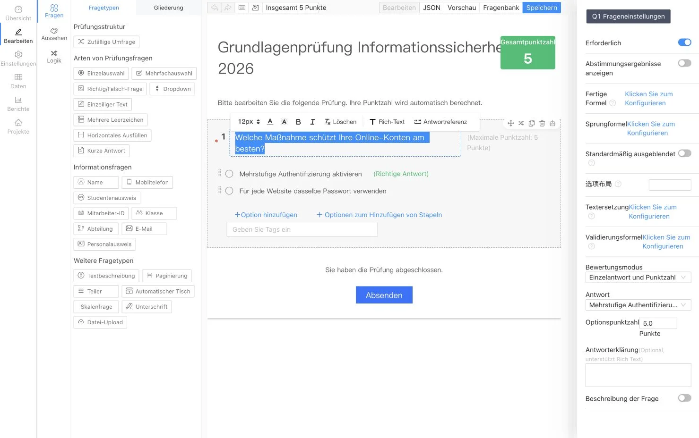

<p align="center">
  
</p>

<h1 align="center">SurveyKing</h1>

<p align="center">
  <strong>Open-Source-Plattform für Umfragen, Prüfungen und Übungen mit Fragenkatalogen – selbst gehostet auf Ihrer eigenen Infrastruktur</strong>
</p>

<p align="center">
  Erstellen Sie Formulare mit KI, führen Sie automatisch bewertete Prüfungen durch, lassen Sie Lernende mit Fragenkatalogen üben und analysieren Sie sämtliche Antworten auf einer zentralen Plattform.
</p>

<p align="center">
  <a href="https://github.com/javahuang/SurveyKing/stargazers"></a>
  <a href="https://github.com/javahuang/SurveyKing/network/members"></a>
  
  <a href="./LICENSE"></a>
  <a href="https://hub.docker.com/r/surveyking/surveyking"></a>
</p>

<p align="center">
  <a href="https://surveyking.cn/">Website</a> ·
  <a href="https://s.surveyking.cn/">Live-Demo</a> ·
  <a href="https://surveyking.cn/help/quickstart/">Dokumentation</a> ·
  <a href="https://surveyking.cn/open-source/deploy/">Bereitstellung</a>
</p>

<p align="center">
  <a href="./README.md">English</a> ·
  <a href="./README.zh-CN.md">简体中文</a> ·
  <a href="./README.zh-TW.md">繁體中文</a> ·
  <a href="./README.ja.md">日本語</a> ·
  <a href="./README.ko.md">한국어</a> ·
  Deutsch ·
  <a href="./README.fr.md">Français</a> ·
  <a href="./README.th.md">ไทย</a>
</p>

> **Behalten Sie die Kontrolle über Ihre Abläufe und Daten.** SurveyKing vereint Inhaltserstellung, Veröffentlichung, Antworten, Bewertung, Übungen, Analysen, Benutzer und Berechtigungen in einem einzigen, direkt bereitstellbaren System. Starten Sie mit der integrierten H2-Datenbank und wechseln Sie zu MySQL, sobald Sie für den Produktivbetrieb bereit sind.

## In einer Minute startklar

Starten Sie SurveyKing mit Docker und der integrierten H2-Datenbank:

```bash
docker run -d \
  --name surveyking \
  -p 1991:1991 \
  surveyking/surveyking:latest
```

Öffnen Sie [http://localhost:1991](http://localhost:1991) und melden Sie sich an:

- Benutzername: `admin`
- Passwort: `123456`
- Ändern Sie das Standardpasswort umgehend. Das neue Passwort muss 8–16 Zeichen lang sein und Großbuchstaben, Kleinbuchstaben sowie Ziffern enthalten.

## Eine Plattform, drei Workflows

| Umfragen | Prüfungen | Übungen mit Fragenkatalogen |
| --- | --- | --- |
| Erstellen Sie responsive Formulare mit mehr als 20 Fragetypen, bedingter Logik, Designs und Veröffentlichungsoptionen | Nutzen Sie Fragenkataloge wieder, legen Sie Antworten und Punktzahlen fest, mischen Sie Inhalte und lassen Sie Einreichungen automatisch bewerten | Bieten Sie sequenzielles und zufälliges Üben sowie das gezielte Wiederholen falsch beantworteter Fragen mit Fortschrittsanzeige auf Desktop- und Mobilgeräten an |
| Erstellen Sie Inhalte mit KI, Excel, Klartext, Vorlagen oder dem visuellen Editor | Analysieren Sie Punktzahlen, Antworten, Ranglisten und die Leistung auf Fragenebene | Ergänzen Sie Antworterklärungen, Favoriten, Notizen, Markierungen und KI-gestützte Erläuterungen |

## Produkttour

> Die Screenshots der Umfrage- und Prüfungseditoren sind auf Deutsch lokalisiert. Die übrigen Produktbilder zeigen derzeit die Benutzeroberfläche auf vereinfachtem Chinesisch. Die Oberfläche von SurveyKing lässt sich auf Englisch, vereinfachtes Chinesisch, traditionelles Chinesisch, Japanisch, Koreanisch, Deutsch, Französisch und Thai umstellen.

### Umfragen und Antwortanalysen

Gestalten Sie Umfragen visuell, prüfen Sie die mobile Vorschau, veröffentlichen Sie ein benutzerfreundliches Formular und verwandeln Sie die erfassten Antworten in Live-Berichte.

<table>
  <tr>
    <td width="50%" align="center"><a href="docs/readme/locales/de/survey-editor.webp"></a><br /><sub>Visueller Editor</sub></td>
    <td width="50%" align="center"><a href="docs/readme/survey-mobile-preview.webp"></a><br /><sub>Mobile Vorschau</sub></td>
  </tr>
  <tr>
    <td width="50%" align="center"><a href="docs/readme/survey-answer-ui.webp"></a><br /><sub>Teilnahmeerlebnis</sub></td>
    <td width="50%" align="center"><a href="docs/readme/survey-report.webp"></a><br /><sub>Antwortanalyse</sub></td>
  </tr>
</table>

### Prüfungen und automatische Bewertung

Erstellen Sie Prüfungen aus wiederverwendbaren Fragenkatalogen, definieren Sie Bewertungsregeln und Erläuterungen, mischen Sie Fragen oder Antwortoptionen und prüfen Sie automatisch berechnete Ergebnisse.

<table>
  <tr>
    <td width="50%" align="center"><a href="docs/readme/locales/de/exam-editor.webp"></a><br /><sub>Prüfungseditor</sub></td>
    <td width="50%" align="center"><a href="docs/readme/exam-mobile-preview.webp"></a><br /><sub>Mobile Vorschau</sub></td>
  </tr>
  <tr>
    <td width="50%" align="center"><a href="docs/readme/exam-answer-ui.webp"></a><br /><sub>Prüfungserlebnis</sub></td>
    <td width="50%" align="center"><a href="docs/readme/exam-data.webp"></a><br /><sub>Punktzahlen und Ergebnisse</sub></td>
  </tr>
</table>

### Üben auf Desktop- und Mobilgeräten

Verwenden Sie denselben Fragenkatalog für formelle Prüfungen und selbstgesteuertes Lernen. Lernende erhalten sofortige Bewertungen, Antwortvergleiche, Erläuterungen, Favoriten, Notizen und Fortschrittsanzeigen sowie einen eigenen Ablauf zur Wiederholung falsch beantworteter Fragen.

<p align="center">
  
  
</p>

### KI-gestützte Erstellung

Beschreiben Sie die gewünschte Umfrage oder Prüfung in natürlicher Sprache. SurveyKing überträgt die generierte Struktur fortlaufend in eine Live-Vorschau, sodass Sie sie vor dem Anlegen des Projekts prüfen können.

<p align="center">
  
</p>

## Was Sie erstellen können

| Bereich | Funktionen |
| --- | --- |
| **Umfragen** | Einfach- und Mehrfachauswahl, Dropdown-Listen, kaskadierende Auswahlfelder, Texteingaben, Matrizen, NPS, Bewertungen, Unterschriften, Datei-Uploads, QR-Codes, Standortangaben und mehr |
| **Logik** | Bedingte Sichtbarkeit, Verzweigungen, Berechnungen, Textersetzung, Validierung, dynamische Pflichtfelder und automatische Optionsauswahl |
| **Veröffentlichung** | Passwörter, Positivlisten, Anmeldepflicht, Zeitpläne, Antwortlimits, öffentliche Ergebnisabfrage und Antworten über WeChat |
| **Prüfungen** | Fragenkataloge, Massenimport, wiederverwendbare Fragen, Zufallsauswahl, Lösungsschlüssel, Bewertungsregeln, automatische Bewertung, Ranglisten und Ergebnisanalyse |
| **Übungen** | Sequenzielles und zufälliges Üben sowie Wiederholen falscher Antworten; Antwortkarten; Markierungen; Favoriten; Notizen; Fortschritt; und KI-gestützte Erläuterungen |
| **Daten** | Bearbeitung von Antworten, Suche, Filter, Importe, Exporte, Drucken, Download von Anhängen und Echtzeitberichte |
| **Administration** | Benutzer, Rollen, Abteilungen, Positionen, Organisationen, Zusammenarbeit und rollenbasierte Zugriffskontrolle (RBAC) |

## KI, Integrationen und Sprachen

- Binden Sie OpenAI-kompatible APIs an und konfigurieren Sie verfügbare sowie standardmäßig verwendete Modelle.
- Erstellen Sie Umfragen und Prüfungen per KI-Streamingausgabe mit Live-Vorschau.
- Nutzen Sie Google OAuth, die QR-Code-Anmeldung über die WeChat Open Platform, die Autorisierung per offiziellem WeChat-Konto und die Kontoverknüpfung.
- Konfigurieren Sie Amap für Standortfragen und verwenden Sie die integrierte H2-Datenbank oder eine externe MySQL-Datenbank.
- Wechseln Sie die Anwendungsoberfläche zwischen Englisch, vereinfachtem Chinesisch, traditionellem Chinesisch, Japanisch, Koreanisch, Deutsch, Französisch und Thai.

## Bereitstellungsoptionen

| Option | Geeignet für | Einstiegspunkt |
| --- | --- | --- |
| **Docker + H2** | Evaluierungen und kleine selbst gehostete Installationen | `surveyking/surveyking:latest` |
| **Docker + MySQL** | Produktivinstallationen mit einer externen Datenbank | [Bereitstellungsleitfaden](https://surveyking.cn/open-source/deploy/) |
| **Windows-Paket** | Schneller Start ohne Container-Werkzeuge | [Bereitstellungsleitfaden](https://surveyking.cn/open-source/deploy/) |
| **Nginx, BaoTa oder EazyDevelop** | Verwaltete oder regionsspezifische Bereitstellungsabläufe | [Alle Bereitstellungsoptionen](https://surveyking.cn/open-source/deploy/) |

Falls Docker Hub in Ihrer Region langsam ist, steht ein Spiegelserver von Alibaba Cloud zur Verfügung:

```bash
docker run -d \
  --name surveyking \
  -p 1991:1991 \
  registry.cn-hangzhou.aliyuncs.com/surveyking/surveyking:latest
```

## Technologie

| Ebene | Technologie |
| --- | --- |
| Frontend | React, Ant Design, responsive Weboberfläche |
| Backend | Java, Spring Boot 2.7, Spring Security, MyBatis-Plus |
| Datenbanken | H2, MySQL |
| Bereitstellung | Docker, Windows, Nginx, BaoTa, EazyDevelop |

## Dokumentation und Community

- [Schnelleinstieg](https://surveyking.cn/help/quickstart/)
- [Bereitstellungsleitfaden](https://surveyking.cn/open-source/deploy/)
- [KI-Konfiguration](https://surveyking.cn/open-source/docs/ai/)
- [Live-Demo](https://s.surveyking.cn/)
- [GitHub Issues](https://github.com/javahuang/SurveyKing/issues)

Issues und Pull Requests sind willkommen. Wenn SurveyKing Ihrem Team hilft, freuen wir uns über einen Stern für das Repository und einen Einblick, wie Sie die Plattform einsetzen.

### Regionale Ressourcen

- [Gitee-Spiegel](https://gitee.com/surveyking/surveyking)
- [Vollständige Funktionsübersicht (Chinesisch)](https://docs.qq.com/sheet/DZEVveUVMSHpVZkJw)
- QQ-Community: `980962382`

## Lizenz

SurveyKing ist Open-Source-Software und wird unter der [MIT-Lizenz](./LICENSE) veröffentlicht.
