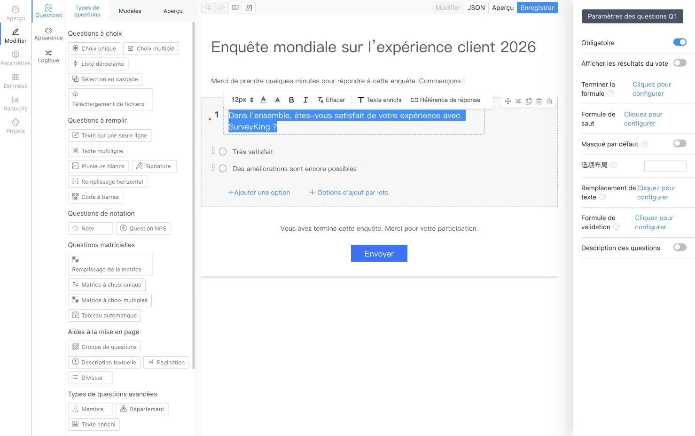
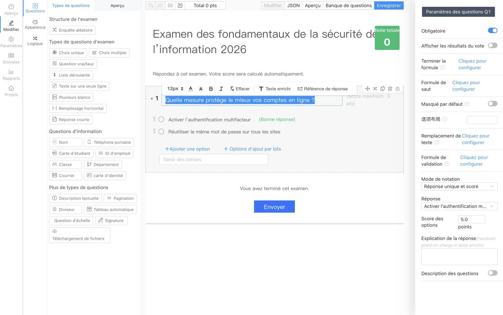

<p align="center">
  
</p>

<h1 align="center">SurveyKing</h1>

<p align="center">
  <strong>Plateforme open source de sondages, d'examens et d'entraînement sur banques de questions, auto-hébergée sur votre infrastructure</strong>
</p>

<p align="center">
  Créez des formulaires avec l'IA, organisez des examens corrigés automatiquement, aidez les apprenants à s'entraîner sur des banques de questions et analysez chaque réponse depuis une plateforme unique.
</p>

<p align="center">
  <a href="https://github.com/javahuang/SurveyKing/stargazers"></a>
  <a href="https://github.com/javahuang/SurveyKing/network/members"></a>
  
  <a href="./LICENSE"></a>
  <a href="https://hub.docker.com/r/surveyking/surveyking"></a>
</p>

<p align="center">
  <a href="https://surveyking.cn/">Site web</a> ·
  <a href="https://s.surveyking.cn/">Démo en ligne</a> ·
  <a href="https://surveyking.cn/help/quickstart/">Documentation</a> ·
  <a href="https://surveyking.cn/open-source/deploy/">Déploiement</a>
</p>

<p align="center">
  <a href="./README.md">English</a> ·
  <a href="./README.zh-CN.md">简体中文</a> ·
  <a href="./README.zh-TW.md">繁體中文</a> ·
  <a href="./README.ja.md">日本語</a> ·
  <a href="./README.ko.md">한국어</a> ·
  <a href="./README.de.md">Deutsch</a> ·
  Français ·
  <a href="./README.th.md">ไทย</a>
</p>

> **Gardez la maîtrise de vos processus et de vos données.** SurveyKing réunit la création de contenu, la publication, la collecte des réponses, la correction, l'entraînement, l'analyse, la gestion des utilisateurs et des autorisations dans un seul système prêt à déployer. Commencez avec la base H2 intégrée, puis passez à MySQL lorsque vous êtes prêt pour la production.

## Opérationnel en une minute

Lancez SurveyKing avec Docker et la base de données H2 intégrée :

```bash
docker run -d \
  --name surveyking \
  -p 1991:1991 \
  surveyking/surveyking:latest
```

Ouvrez [http://localhost:1991](http://localhost:1991), puis connectez-vous :

- Nom d'utilisateur : `admin`
- Mot de passe : `123456`
- Modifiez immédiatement le mot de passe par défaut. Le nouveau mot de passe doit comporter 8 à 16 caractères et contenir des lettres majuscules, des lettres minuscules et des chiffres.

## Une plateforme, trois usages

| Sondages | Examens | Entraînement sur banques de questions |
| --- | --- | --- |
| Créez des formulaires adaptatifs avec plus de 20 types de questions, une logique conditionnelle, des thèmes et des options de publication | Réutilisez des banques de questions, configurez les réponses et les barèmes, mélangez le contenu et corrigez automatiquement les soumissions | Proposez un entraînement séquentiel, aléatoire ou ciblé sur les erreurs, avec suivi de la progression sur ordinateur et mobile |
| Créez avec l'IA, Excel, du texte brut, des modèles ou l'éditeur visuel | Analysez les notes, les réponses, les classements et les résultats question par question | Ajoutez des explications, des favoris, des notes, des signalements et des explications assistées par l'IA |

## Visite guidée du produit

> Les captures des éditeurs de sondages et d'examens sont localisées en français. Les autres images du produit présentent actuellement l'interface en chinois simplifié. L'interface de SurveyKing est disponible en anglais, chinois simplifié, chinois traditionnel, japonais, coréen, allemand, français et thaï.

### Sondages et analyse des réponses

Concevez vos sondages visuellement, prévisualisez-les sur mobile, publiez un formulaire agréable à remplir et transformez les réponses collectées en rapports actualisés en temps réel.

<table>
  <tr>
    <td width="50%" align="center"><a href="docs/readme/locales/fr/survey-editor.webp"></a><br /><sub>Éditeur visuel</sub></td>
    <td width="50%" align="center"><a href="docs/readme/survey-mobile-preview.webp"></a><br /><sub>Aperçu mobile</sub></td>
  </tr>
  <tr>
    <td width="50%" align="center"><a href="docs/readme/survey-answer-ui.webp"></a><br /><sub>Expérience du répondant</sub></td>
    <td width="50%" align="center"><a href="docs/readme/survey-report.webp"></a><br /><sub>Analyse des réponses</sub></td>
  </tr>
</table>

### Examens et correction automatique

Composez des examens à partir de banques de questions réutilisables, définissez les règles de notation et les explications, mélangez les questions ou les choix de réponse, puis consultez les résultats calculés automatiquement.

<table>
  <tr>
    <td width="50%" align="center"><a href="docs/readme/locales/fr/exam-editor.webp"></a><br /><sub>Éditeur d'examens</sub></td>
    <td width="50%" align="center"><a href="docs/readme/exam-mobile-preview.webp"></a><br /><sub>Aperçu mobile</sub></td>
  </tr>
  <tr>
    <td width="50%" align="center"><a href="docs/readme/exam-answer-ui.webp"></a><br /><sub>Expérience du candidat</sub></td>
    <td width="50%" align="center"><a href="docs/readme/exam-data.webp"></a><br /><sub>Notes et résultats</sub></td>
  </tr>
</table>

### Entraînement sur ordinateur et mobile

Utilisez la même banque de questions pour les examens officiels et l'apprentissage en autonomie. Les apprenants bénéficient d'une correction instantanée, d'une comparaison des réponses, d'explications, de favoris, de notes, d'un suivi de progression et d'un parcours dédié aux réponses incorrectes.

<p align="center">
  
  
</p>

### Création assistée par l'IA

Décrivez en langage naturel le sondage ou l'examen dont vous avez besoin. SurveyKing transmet progressivement la structure générée vers un aperçu en direct, afin que vous puissiez la vérifier avant de créer le projet.

<p align="center">
  
</p>

## Ce que vous pouvez créer

| Domaine | Fonctionnalités |
| --- | --- |
| **Sondages** | Choix unique et multiple, listes déroulantes, choix en cascade, champs de texte, matrices, NPS, évaluations, signatures, envoi de fichiers, codes QR, géolocalisation et plus encore |
| **Logique** | Affichage conditionnel, branchements, calculs, remplacement de texte, validation, champs obligatoires dynamiques et sélection automatique d'options |
| **Publication** | Mots de passe, listes d'autorisation, authentification obligatoire, planification, limites de réponses, consultation publique des résultats et réponses via WeChat |
| **Examens** | Banques de questions, import en masse, questions réutilisables, sélection aléatoire, corrigés, barèmes, correction automatique, classements et analyse des résultats |
| **Entraînement** | Entraînement séquentiel, aléatoire ou sur les réponses incorrectes ; fiches de réponses ; signalements ; favoris ; notes ; progression ; et explications assistées par l'IA |
| **Données** | Modification des réponses, recherche, filtres, imports, exports, impression, téléchargement des pièces jointes et rapports en temps réel |
| **Administration** | Utilisateurs, rôles, services, postes, organisations, collaboration et contrôle d'accès basé sur les rôles (RBAC) |

## IA, intégrations et langues

- Connectez des API compatibles avec OpenAI et configurez les modèles disponibles ainsi que le modèle par défaut.
- Générez des sondages et des examens avec une sortie IA en streaming et un aperçu en direct.
- Utilisez Google OAuth, la connexion par QR code de WeChat Open Platform, l'autorisation via un compte officiel WeChat et l'association de comptes.
- Configurez Amap pour les questions de géolocalisation et utilisez la base H2 intégrée ou une base MySQL externe.
- Basculez l'interface de l'application entre l'anglais, le chinois simplifié, le chinois traditionnel, le japonais, le coréen, l'allemand, le français et le thaï.

## Options de déploiement

| Option | Idéal pour | Point de départ |
| --- | --- | --- |
| **Docker + H2** | Évaluation et petits déploiements auto-hébergés | `surveyking/surveyking:latest` |
| **Docker + MySQL** | Déploiements en production avec une base de données externe | [Guide de déploiement](https://surveyking.cn/open-source/deploy/) |
| **Package Windows** | Démarrage rapide sans outil de conteneurisation | [Guide de déploiement](https://surveyking.cn/open-source/deploy/) |
| **Nginx, BaoTa ou EazyDevelop** | Processus de déploiement administrés ou propres à certaines régions | [Toutes les options de déploiement](https://surveyking.cn/open-source/deploy/) |

Si Docker Hub est lent dans votre région, un miroir Alibaba Cloud est disponible :

```bash
docker run -d \
  --name surveyking \
  -p 1991:1991 \
  registry.cn-hangzhou.aliyuncs.com/surveyking/surveyking:latest
```

## Technologies

| Couche | Technologie |
| --- | --- |
| Frontend | React, Ant Design, interface web adaptative |
| Backend | Java, Spring Boot 2.7, Spring Security, MyBatis-Plus |
| Bases de données | H2, MySQL |
| Déploiement | Docker, Windows, Nginx, BaoTa, EazyDevelop |

## Documentation et communauté

- [Démarrage rapide](https://surveyking.cn/help/quickstart/)
- [Guide de déploiement](https://surveyking.cn/open-source/deploy/)
- [Configuration de l'IA](https://surveyking.cn/open-source/docs/ai/)
- [Démo en ligne](https://s.surveyking.cn/)
- [GitHub Issues](https://github.com/javahuang/SurveyKing/issues)

Issues et pull requests sont les bienvenus. Si SurveyKing est utile à votre équipe, pensez à ajouter une étoile au dépôt et à nous expliquer comment vous l'utilisez.

### Ressources régionales

- [Miroir Gitee](https://gitee.com/surveyking/surveyking)
- [Liste complète des fonctionnalités (en chinois)](https://docs.qq.com/sheet/DZEVveUVMSHpVZkJw)
- Communauté QQ : `980962382`

## Licence

SurveyKing est un logiciel open source distribué sous [licence MIT](./LICENSE).
