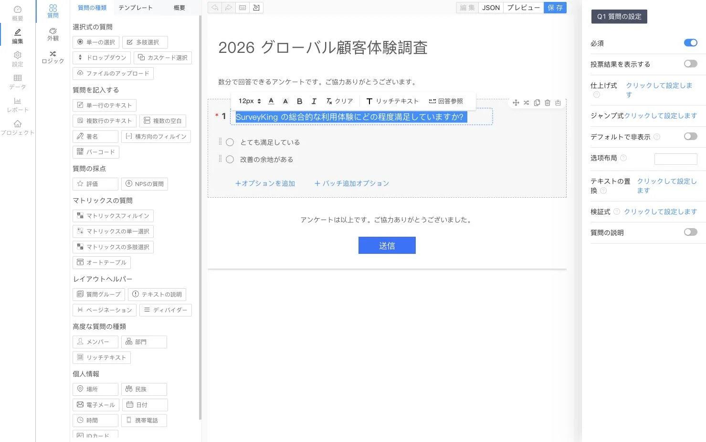
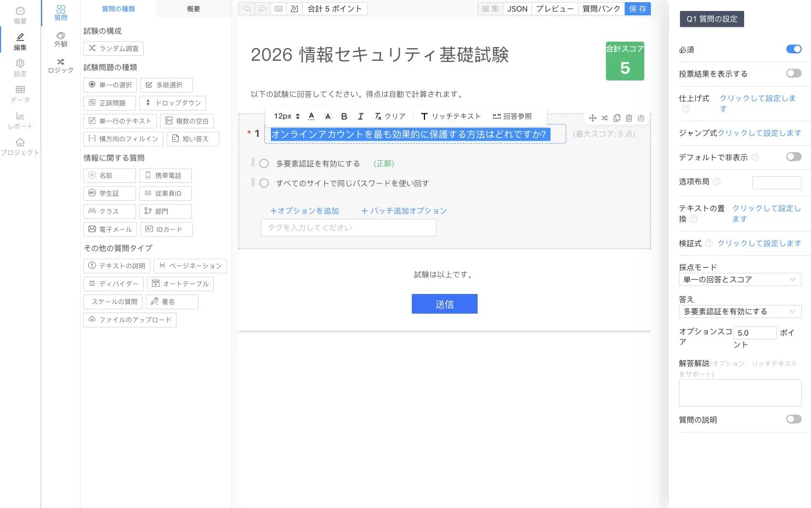

<p align="center">
  
</p>

<h1 align="center">SurveyKing</h1>

<p align="center">
  <strong>オープンソースのアンケート、試験、問題演習を、自分たちのインフラでセルフホスト</strong>
</p>

<p align="center">
  AI でフォームを作成し、試験を自動採点。問題バンクを活用した学習を支援し、すべての回答を一つのプラットフォームで分析できます。
</p>

<p align="center">
  <a href="https://github.com/javahuang/SurveyKing/stargazers"></a>
  <a href="https://github.com/javahuang/SurveyKing/network/members"></a>
  
  <a href="./LICENSE"></a>
  <a href="https://hub.docker.com/r/surveyking/surveyking"></a>
</p>

<p align="center">
  <a href="https://surveyking.cn/">ウェブサイト</a> ·
  <a href="https://s.surveyking.cn/">ライブデモ</a> ·
  <a href="https://surveyking.cn/help/quickstart/">ドキュメント</a> ·
  <a href="https://surveyking.cn/open-source/deploy/">デプロイ</a>
</p>

<p align="center">
  <a href="./README.md">English</a> ·
  <a href="./README.zh-CN.md">简体中文</a> ·
  <a href="./README.zh-TW.md">繁體中文</a> ·
  日本語 ·
  <a href="./README.ko.md">한국어</a> ·
  <a href="./README.de.md">Deutsch</a> ·
  <a href="./README.fr.md">Français</a> ·
  <a href="./README.th.md">ไทย</a>
</p>

> **ワークフローもデータも、自分たちの手に。** SurveyKing は、コンテンツ作成、公開、回答、採点、演習、分析、ユーザー、権限を、導入可能な一つのシステムに集約します。まずは内蔵 H2 データベースで始め、実運用の準備が整ったら MySQL へ移行できます。

## 1分で起動

Docker と内蔵 H2 データベースを使って SurveyKing を起動します。

```bash
docker run -d \
  --name surveyking \
  -p 1991:1991 \
  surveyking/surveyking:latest
```

[http://localhost:1991](http://localhost:1991) を開き、次の情報でサインインします。

- ユーザー名：`admin`
- パスワード：`123456`
- デフォルトのパスワードはすぐに変更してください。新しいパスワードは8〜16文字で、大文字、小文字、数字を含める必要があります。

## 1つのプラットフォーム、3つのワークフロー

| アンケート | 試験 | 問題演習 |
| --- | --- | --- |
| 20種類以上の質問形式、条件分岐、テーマ、公開設定に対応したレスポンシブフォームを作成 | 問題バンクを再利用し、正答と配点を設定。内容をランダム化し、提出された答案を自動採点 | PC とモバイルで、順番・ランダム・誤答演習と進捗管理を提供 |
| AI、Excel、プレーンテキスト、テンプレート、ビジュアルエディターから作成 | 得点、解答内容、順位、設問ごとの成績を分析 | 解答解説、お気に入り、メモ、問題へのフラグ付け、AI による解説支援を追加 |

## 製品ツアー

> アンケートと試験のエディター画面は日本語にローカライズされています。その他の製品スクリーンショットは現在、簡体字中国語の画面を表示しています。SurveyKing の画面は、英語、簡体字中国語、繁体字中国語、日本語、韓国語、ドイツ語、フランス語、タイ語に切り替えられます。

### アンケートと回答分析

アンケートを視覚的に設計し、モバイルでプレビューして、回答者が使いやすいフォームを公開できます。収集した回答はリアルタイムレポートとして可視化されます。

<table>
  <tr>
    <td width="50%" align="center"><a href="docs/readme/locales/ja/survey-editor.webp"></a><br /><sub>ビジュアルエディター</sub></td>
    <td width="50%" align="center"><a href="docs/readme/survey-mobile-preview.webp"></a><br /><sub>モバイルプレビュー</sub></td>
  </tr>
  <tr>
    <td width="50%" align="center"><a href="docs/readme/survey-answer-ui.webp"></a><br /><sub>回答者向け画面</sub></td>
    <td width="50%" align="center"><a href="docs/readme/survey-report.webp"></a><br /><sub>回答分析</sub></td>
  </tr>
</table>

### 試験と自動採点

再利用可能な問題バンクから試験を作成し、採点ルールと解説を設定できます。問題や選択肢をランダム化し、自動計算された結果を確認できます。

<table>
  <tr>
    <td width="50%" align="center"><a href="docs/readme/locales/ja/exam-editor.webp"></a><br /><sub>試験エディター</sub></td>
    <td width="50%" align="center"><a href="docs/readme/exam-mobile-preview.webp"></a><br /><sub>モバイルプレビュー</sub></td>
  </tr>
  <tr>
    <td width="50%" align="center"><a href="docs/readme/exam-answer-ui.webp"></a><br /><sub>受験者向け画面</sub></td>
    <td width="50%" align="center"><a href="docs/readme/exam-data.webp"></a><br /><sub>得点と結果</sub></td>
  </tr>
</table>

### PC とモバイルで演習

同じ問題バンクを正式な試験と自主学習の両方に活用できます。学習者は、即時採点、解答比較、解説、お気に入り、メモ、進捗、誤答演習を利用できます。

<p align="center">
  
  
</p>

### AI 支援による作成

必要なアンケートや試験を自然言語で説明してください。SurveyKing が生成した構成をリアルタイムプレビューにストリーミングするため、プロジェクトを作成する前に内容を確認できます。

<p align="center">
  
</p>

## 作成できるもの

| 分野 | 機能 |
| --- | --- |
| **アンケート** | 単一選択、複数選択、ドロップダウン、連動選択、テキスト入力、マトリクス、NPS、評価、署名、ファイルアップロード、QR コード、位置情報など |
| **ロジック** | 条件付き表示、分岐、計算、テキスト置換、バリデーション、動的な必須設定、選択肢の自動選択 |
| **公開** | パスワード、許可リスト、ログイン必須化、スケジュール、回答数上限、公開結果の照会、WeChat 経由の回答 |
| **試験** | 問題バンク、一括インポート、問題の再利用、ランダム出題、正答、採点ルール、自動採点、順位、結果分析 |
| **演習** | 順番・ランダム・誤答演習、解答カード、フラグ、お気に入り、メモ、進捗、AI による解説支援 |
| **データ** | 回答の編集、検索、フィルター、インポート、エクスポート、印刷、添付ファイルのダウンロード、リアルタイムレポート |
| **管理** | ユーザー、ロール、部門、役職、組織、共同作業、ロールベースアクセス制御（RBAC） |

## AI、連携機能、対応言語

- OpenAI 互換 API に接続し、利用可能なモデルとデフォルトモデルを設定できます。
- ストリーミング AI 出力とリアルタイムプレビューを使って、アンケートや試験を生成できます。
- Google OAuth、WeChat Open Platform の QR コードログイン、WeChat 公式アカウント認証、アカウント連携に対応しています。
- 位置情報の質問には Amap を設定でき、データベースには内蔵 H2 または外部 MySQL を利用できます。
- アプリケーションの表示言語を、英語、簡体字中国語、繁体字中国語、日本語、韓国語、ドイツ語、フランス語、タイ語から選択できます。

## デプロイ方法

| 方法 | 適した用途 | 開始方法 |
| --- | --- | --- |
| **Docker + H2** | 評価環境、小規模なセルフホスト環境 | `surveyking/surveyking:latest` |
| **Docker + MySQL** | 外部データベースを使用する本番環境 | [デプロイガイド](https://surveyking.cn/open-source/deploy/) |
| **Windows パッケージ** | コンテナツールなしですぐに開始 | [デプロイガイド](https://surveyking.cn/open-source/deploy/) |
| **Nginx、BaoTa、EazyDevelop** | マネージドまたは地域固有のデプロイワークフロー | [すべてのデプロイ方法](https://surveyking.cn/open-source/deploy/) |

利用地域で Docker Hub が遅い場合は、Alibaba Cloud のミラーを利用できます。

```bash
docker run -d \
  --name surveyking \
  -p 1991:1991 \
  registry.cn-hangzhou.aliyuncs.com/surveyking/surveyking:latest
```

## 技術スタック

| レイヤー | 技術 |
| --- | --- |
| フロントエンド | React、Ant Design、レスポンシブ Web UI |
| バックエンド | Java、Spring Boot 2.7、Spring Security、MyBatis-Plus |
| データベース | H2、MySQL |
| デプロイ | Docker、Windows、Nginx、BaoTa、EazyDevelop |

## ドキュメントとコミュニティ

- [クイックスタート](https://surveyking.cn/help/quickstart/)
- [デプロイガイド](https://surveyking.cn/open-source/deploy/)
- [AI 設定](https://surveyking.cn/open-source/docs/ai/)
- [ライブデモ](https://s.surveyking.cn/)
- [GitHub Issues](https://github.com/javahuang/SurveyKing/issues)

Issue と Pull Request を歓迎します。SurveyKing がチームのお役に立ったら、リポジトリへの Star と活用方法の共有をご検討ください。

### 地域向けリソース

- [Gitee ミラー](https://gitee.com/surveyking/surveyking)
- [全機能一覧（中国語）](https://docs.qq.com/sheet/DZEVveUVMSHpVZkJw)
- QQ コミュニティ：`980962382`

## ライセンス

SurveyKing は [MIT ライセンス](./LICENSE)で公開されているオープンソースソフトウェアです。
