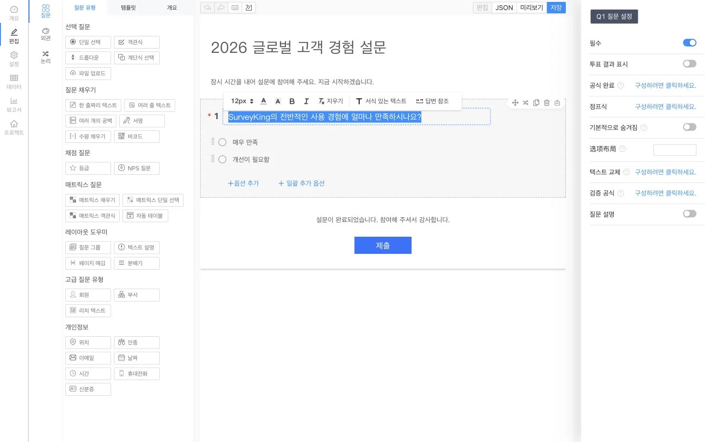
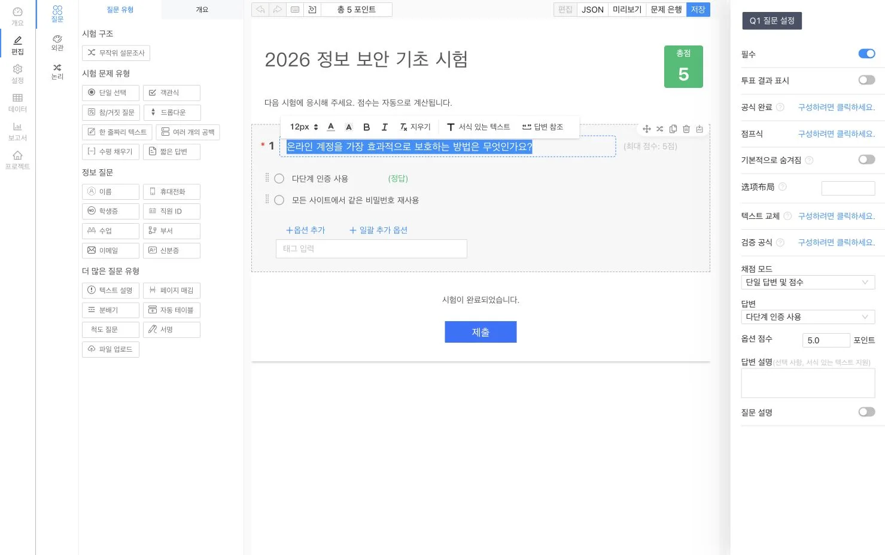

<p align="center">
  
</p>

<h1 align="center">SurveyKing</h1>

<p align="center">
  <strong>오픈 소스 설문조사, 시험, 문제 은행 학습을 자체 인프라에서 셀프 호스팅하세요</strong>
</p>

<p align="center">
  AI로 양식을 만들고, 시험을 자동 채점하며, 문제 은행을 활용한 학습을 지원하고, 모든 응답을 하나의 플랫폼에서 분석할 수 있습니다.
</p>

<p align="center">
  <a href="https://github.com/javahuang/SurveyKing/stargazers"></a>
  <a href="https://github.com/javahuang/SurveyKing/network/members"></a>
  
  <a href="./LICENSE"></a>
  <a href="https://hub.docker.com/r/surveyking/surveyking"></a>
</p>

<p align="center">
  <a href="https://surveyking.cn/">웹사이트</a> ·
  <a href="https://s.surveyking.cn/">라이브 데모</a> ·
  <a href="https://surveyking.cn/help/quickstart/">문서</a> ·
  <a href="https://surveyking.cn/open-source/deploy/">배포</a>
</p>

<p align="center">
  <a href="./README.md">English</a> ·
  <a href="./README.zh-CN.md">简体中文</a> ·
  <a href="./README.zh-TW.md">繁體中文</a> ·
  <a href="./README.ja.md">日本語</a> ·
  한국어 ·
  <a href="./README.de.md">Deutsch</a> ·
  <a href="./README.fr.md">Français</a> ·
  <a href="./README.th.md">ไทย</a>
</p>

> **워크플로와 데이터의 주도권을 직접 확보하세요.** SurveyKing은 콘텐츠 제작, 게시, 응답, 채점, 학습, 분석, 사용자, 권한을 배포 가능한 하나의 시스템으로 통합합니다. 내장 H2 데이터베이스로 시작하고, 운영 환경을 준비할 때 MySQL로 전환할 수 있습니다.

## 1분 만에 실행하기

Docker와 내장 H2 데이터베이스로 SurveyKing을 시작하세요.

```bash
docker run -d \
  --name surveyking \
  -p 1991:1991 \
  surveyking/surveyking:latest
```

[http://localhost:1991](http://localhost:1991)을 열고 다음 정보로 로그인하세요.

- 사용자 이름: `admin`
- 비밀번호: `123456`
- 기본 비밀번호를 즉시 변경하세요. 새 비밀번호는 8~16자이며 영문 대문자, 영문 소문자, 숫자를 포함해야 합니다.

## 하나의 플랫폼, 세 가지 워크플로

| 설문조사 | 시험 | 문제 은행 학습 |
| --- | --- | --- |
| 20개 이상의 질문 유형, 조건부 로직, 테마, 게시 설정 기능을 갖춘 반응형 양식 제작 | 문제 은행 재사용, 정답과 배점 설정, 내용 무작위 구성, 제출 답안 자동 채점 | 데스크톱과 모바일에서 순차·무작위·오답 학습과 진도 추적 제공 |
| AI, Excel, 일반 텍스트, 템플릿 또는 시각적 편집기로 제작 | 점수, 답안, 순위, 문항별 성과 분석 | 답안 해설, 즐겨찾기, 메모, 문항 표시, AI 기반 해설 추가 |

## 제품 둘러보기

> 설문조사와 시험 편집기 스크린샷은 한국어로 현지화되어 있습니다. 나머지 제품 스크린샷은 현재 중국어 간체 인터페이스를 보여 줍니다. SurveyKing 인터페이스는 영어, 중국어 간체, 중국어 번체, 일본어, 한국어, 독일어, 프랑스어, 태국어로 전환할 수 있습니다.

### 설문조사 및 응답 분석

설문조사를 시각적으로 설계하고, 모바일에서 미리 본 뒤, 응답자가 사용하기 편한 양식을 게시하세요. 수집된 응답은 실시간 보고서로 전환할 수 있습니다.

<table>
  <tr>
    <td width="50%" align="center"><a href="docs/readme/locales/ko/survey-editor.webp"></a><br /><sub>시각적 편집기</sub></td>
    <td width="50%" align="center"><a href="docs/readme/survey-mobile-preview.webp"></a><br /><sub>모바일 미리보기</sub></td>
  </tr>
  <tr>
    <td width="50%" align="center"><a href="docs/readme/survey-answer-ui.webp"></a><br /><sub>응답자 화면</sub></td>
    <td width="50%" align="center"><a href="docs/readme/survey-report.webp"></a><br /><sub>응답 분석</sub></td>
  </tr>
</table>

### 시험 및 자동 채점

재사용 가능한 문제 은행으로 시험을 만들고, 채점 규칙과 해설을 설정하며, 문제나 선택지를 무작위화하고, 자동으로 계산된 결과를 검토할 수 있습니다.

<table>
  <tr>
    <td width="50%" align="center"><a href="docs/readme/locales/ko/exam-editor.webp"></a><br /><sub>시험 편집기</sub></td>
    <td width="50%" align="center"><a href="docs/readme/exam-mobile-preview.webp"></a><br /><sub>모바일 미리보기</sub></td>
  </tr>
  <tr>
    <td width="50%" align="center"><a href="docs/readme/exam-answer-ui.webp"></a><br /><sub>응시자 화면</sub></td>
    <td width="50%" align="center"><a href="docs/readme/exam-data.webp"></a><br /><sub>점수 및 결과</sub></td>
  </tr>
</table>

### 데스크톱과 모바일에서 학습

동일한 문제 은행을 정식 시험과 자기 주도 학습에 모두 활용하세요. 학습자는 즉시 채점, 답안 비교, 해설, 즐겨찾기, 메모, 진도, 오답 학습 기능을 이용할 수 있습니다.

<p align="center">
  
  
</p>

### AI 기반 제작

필요한 설문조사나 시험을 자연어로 설명하세요. SurveyKing은 생성된 구조를 실시간 미리보기로 스트리밍하므로, 프로젝트를 만들기 전에 내용을 검토할 수 있습니다.

<p align="center">
  
</p>

## 만들 수 있는 것

| 영역 | 기능 |
| --- | --- |
| **설문조사** | 단일 및 다중 선택, 드롭다운, 연동형 선택, 텍스트 입력, 행렬, NPS, 평점, 서명, 파일 업로드, QR 코드, 위치 등 |
| **로직** | 조건부 표시, 분기, 계산, 텍스트 치환, 유효성 검사, 동적 필수 항목, 선택지 자동 선택 |
| **게시** | 비밀번호, 허용 목록, 로그인 필수, 일정, 응답 수 제한, 공개 결과 조회, WeChat 기반 응답 |
| **시험** | 문제 은행, 대량 가져오기, 문제 재사용, 무작위 선택, 정답, 채점 규칙, 자동 채점, 순위, 결과 분석 |
| **학습** | 순차·무작위·오답 학습, 답안 카드, 문항 표시, 즐겨찾기, 메모, 진도, AI 기반 해설 |
| **데이터** | 응답 편집, 검색, 필터, 가져오기, 내보내기, 인쇄, 첨부 파일 다운로드, 실시간 보고서 |
| **관리** | 사용자, 역할, 부서, 직책, 조직, 협업, 역할 기반 접근 제어(RBAC) |

## AI, 연동 및 지원 언어

- OpenAI 호환 API를 연결하고 사용 가능한 모델과 기본 모델을 설정할 수 있습니다.
- 스트리밍 AI 출력과 실시간 미리보기로 설문조사와 시험을 생성할 수 있습니다.
- Google OAuth, WeChat Open Platform QR 로그인, WeChat 공식 계정 인증, 계정 연결을 사용할 수 있습니다.
- 위치 문항에 Amap을 설정하고, 내장 H2 또는 외부 MySQL 데이터베이스를 사용할 수 있습니다.
- 애플리케이션 인터페이스를 영어, 중국어 간체, 중국어 번체, 일본어, 한국어, 독일어, 프랑스어, 태국어 중에서 전환할 수 있습니다.

## 배포 옵션

| 옵션 | 적합한 용도 | 시작 방법 |
| --- | --- | --- |
| **Docker + H2** | 평가 및 소규모 셀프 호스팅 배포 | `surveyking/surveyking:latest` |
| **Docker + MySQL** | 외부 데이터베이스를 사용하는 운영 배포 | [배포 가이드](https://surveyking.cn/open-source/deploy/) |
| **Windows 패키지** | 컨테이너 도구 없이 빠르게 시작 | [배포 가이드](https://surveyking.cn/open-source/deploy/) |
| **Nginx, BaoTa 또는 EazyDevelop** | 관리형 또는 지역별 배포 워크플로 | [모든 배포 옵션](https://surveyking.cn/open-source/deploy/) |

사용 중인 지역에서 Docker Hub가 느리다면 Alibaba Cloud 미러를 이용할 수 있습니다.

```bash
docker run -d \
  --name surveyking \
  -p 1991:1991 \
  registry.cn-hangzhou.aliyuncs.com/surveyking/surveyking:latest
```

## 기술 스택

| 계층 | 기술 |
| --- | --- |
| 프런트엔드 | React, Ant Design, 반응형 웹 UI |
| 백엔드 | Java, Spring Boot 2.7, Spring Security, MyBatis-Plus |
| 데이터베이스 | H2, MySQL |
| 배포 | Docker, Windows, Nginx, BaoTa, EazyDevelop |

## 문서 및 커뮤니티

- [빠른 시작](https://surveyking.cn/help/quickstart/)
- [배포 가이드](https://surveyking.cn/open-source/deploy/)
- [AI 설정](https://surveyking.cn/open-source/docs/ai/)
- [라이브 데모](https://s.surveyking.cn/)
- [GitHub Issues](https://github.com/javahuang/SurveyKing/issues)

Issue와 Pull Request를 환영합니다. SurveyKing이 팀에 도움이 된다면 저장소에 Star를 남기고 활용 사례를 공유해 주세요.

### 지역별 리소스

- [Gitee 미러](https://gitee.com/surveyking/surveyking)
- [전체 기능 목록(중국어)](https://docs.qq.com/sheet/DZEVveUVMSHpVZkJw)
- QQ 커뮤니티: `980962382`

## 라이선스

SurveyKing은 [MIT 라이선스](./LICENSE)로 배포되는 오픈 소스 소프트웨어입니다.
