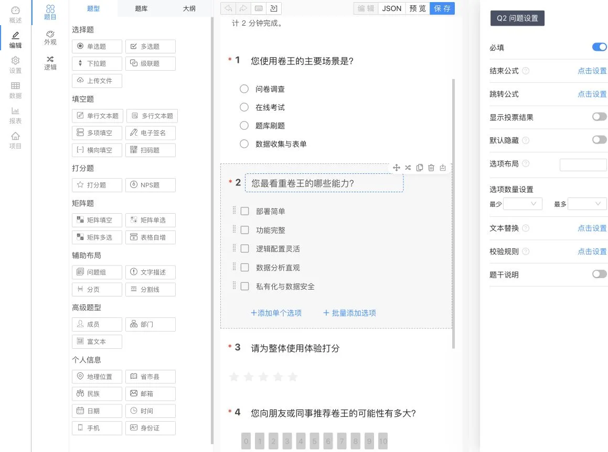
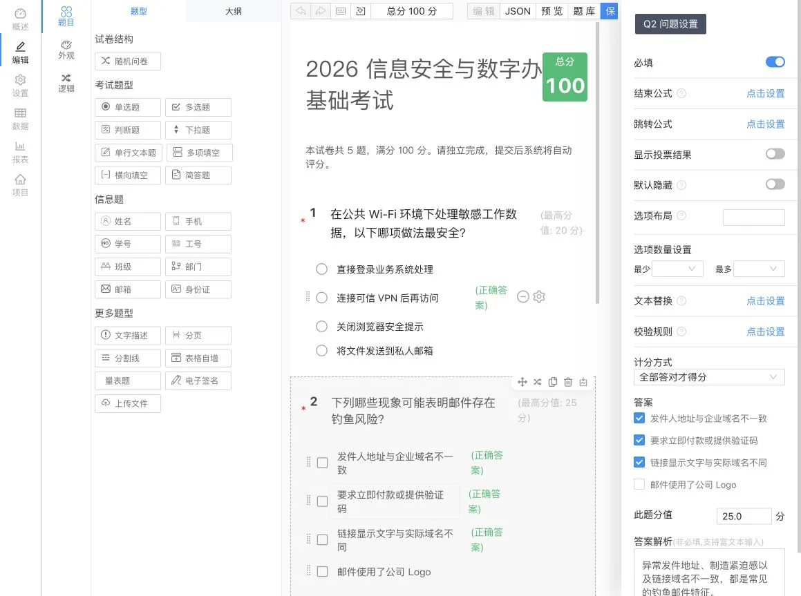

<p align="center">
  
</p>

<h1 align="center">卷王 SurveyKing</h1>

<p align="center">
  <strong>功能强大、部署简单的开源问卷、考试与刷题一体化平台</strong>
</p>

<p align="center">
  一套系统覆盖内容创建、发布作答、题库练习、数据分析和权限管理，支持 Windows、宝塔、Docker等多种一键私有部署方式。
</p>

<p align="center">
  <a href="https://gitee.com/surveyking/surveyking/stargazers"></a>
  <a href="https://gitee.com/surveyking/surveyking/members"></a>
  <a href="https://github.com/javahuang/surveyking/stargazers"></a>
  <a href="https://github.com/javahuang/surveyking/network/members"></a>
  
  <a href="./LICENSE"></a>
  <a href="https://hub.docker.com/r/surveyking/surveyking"></a>
</p>

<p align="center">
  <a href="https://surveyking.cn/">官方网站</a> ·
  <a href="https://surveyking.cn/open-source/deploy/">部署文档</a> ·
  <a href="https://surveyking.cn/help/quickstart/">操作手册</a> ·
  <a href="https://s.surveyking.cn/">在线体验</a> ·
  <a href="https://docs.qq.com/sheet/DZEVveUVMSHpVZkJw">功能清单</a>
</p>

<p align="center">
  简体中文 · <a href="./README.en-us.md">English</a>
</p>

> **我们的目标：做开源问卷与考试领域中部署最简单、功能最完整的一体化系统。**
>
> 卷王是开源生态中少有的同时覆盖问卷、考试、题库刷题、数据分析、权限管理、AI、国际化与第三方集成，并允许用户自主私有部署的完整方案。内置 H2 数据库，无需额外安装数据库，并支持 Windows、宝塔等一键部署方式。

## 三大核心场景

| 问卷调查                                                 | 在线考试                                         | 题库刷题                                           |
| -------------------------------------------------------- | ------------------------------------------------ | -------------------------------------------------- |
| 20+ 题型、条件逻辑、外观设计、发布控制、移动端作答       | 题库组卷、正确答案、分值配置、自动评分、成绩统计 | 顺序练习、随机练习、错题练习、移动端刷题、进度记录 |
| 支持 AI 创建、Excel 导入、文本导入、模板导入和可视化编辑 | 支持单选、多选、判断、填空、简答和随机题目       | 题库内容可复用到考试与练习，形成学习闭环           |

## 平台能力

| 模块             | 主要能力                                                                     |
| ---------------- | ---------------------------------------------------------------------------- |
| **数据**   | 答卷新增、编辑、筛选、标记、导入、导出、打印、附件打包下载和实时统计报表     |
| **管理**   | 用户、角色、部门、职位、组织架构、项目协作、题库协作和 RBAC 权限控制         |
| **AI**     | 自然语言创建问卷与考试、流式生成、实时预览、模型切换和 OpenAI Compatible API |
| **国际化** | 系统界面与提示多语言、默认语言配置、AI 多语言生成、语言资源可持续扩展        |

## 第三方集成

| 集成方向              | 已支持能力                                                                   |
| --------------------- | ---------------------------------------------------------------------------- |
| **AI 模型服务** | 支持 OpenAI Compatible API，可接入 SiliconFlow、DeepSeek、Qwen、Llama 等模型 |
| **第三方登录**  | Google OAuth、微信开放平台扫码登录、微信公众号授权与账号绑定                 |
| **微信问卷**    | 支持限制仅在微信内填写，可按配置获取微信昵称和头像                           |
| **地图能力**    | 支持高德地图 Key 与安全密钥配置，用于地理位置题型                            |
| **部署生态**    | Windows 快速安装包、Docker Hub、阿里云镜像、宝塔和 EazyDevelop               |
| **数据存储**    | 内置 H2 开箱即用，生产环境支持 MySQL                                         |

## 为什么选择卷王

- **真正的一体化**：问卷、考试和刷题不是三个割裂的系统，题库、用户、权限和数据可以统一管理。
- **真正可私有部署**：代码与数据由用户自己掌控，适合企业、学校、政务、培训和个人场景。
- **部署门槛低**：内置 H2 数据库，支持 Windows 快速安装、宝塔一键部署和容器化部署。
- **功能闭环完整**：从创建、发布、作答，到评分、练习、报表和导出均在同一平台完成。
- **逻辑能力灵活**：支持显示隐藏、跳转、计算、校验、必填、自动勾选和动态文本等复杂规则。
- **开放且可扩展**：支持 AI、OAuth、微信、高德地图以及多语言扩展。

## 产品预览

### 问卷调查与数据分析

四个视图展示可视化编辑器、编辑器手机预览、用户实际填写界面，以及使用 45 份差异化演示答卷生成的数据报表。

<table>
  <tr>
    <td width="50%" align="center"><a href="docs/readme/survey-editor.webp"></a><br /><sub>可视化编辑器</sub></td>
    <td width="50%" align="center"><a href="docs/readme/survey-mobile-preview.webp"></a><br /><sub>手机端预览</sub></td>
  </tr>
  <tr>
    <td width="50%" align="center"><a href="docs/readme/survey-answer-ui.webp"></a><br /><sub>用户填写界面</sub></td>
    <td width="50%" align="center"><a href="docs/readme/survey-report.webp"></a><br /><sub>数据分析报表</sub></td>
  </tr>
</table>

### 在线考试与自动评分

四个视图展示考试编辑器、编辑器手机预览、考生实际作答界面，以及包含 32 份演示答卷的成绩数据，分数覆盖 40、60、75、80 和 100 分。

<table>
  <tr>
    <td width="50%" align="center"><a href="docs/readme/exam-editor.webp"></a><br /><sub>考试编辑器</sub></td>
    <td width="50%" align="center"><a href="docs/readme/exam-mobile-preview.webp"></a><br /><sub>手机端预览</sub></td>
  </tr>
  <tr>
    <td width="50%" align="center"><a href="docs/readme/exam-answer-ui.webp"></a><br /><sub>考生作答界面</sub></td>
    <td width="50%" align="center"><a href="docs/readme/exam-data.webp"></a><br /><sub>成绩数据</sub></td>
  </tr>
</table>

### 刷题模式（PC 与移动端）

同一题库可用于考试和日常练习。PC 端提供答题卡、题目标记、连续答对移出错题集和 AI 解析；移动端支持即时判题、答案对照、答题卡、收藏、笔记与练习设置。

<p align="center">
  
  
</p>

### AI 智能创建

通过自然语言描述需求，AI 可生成问卷或考试初稿，并在创建前实时预览。

<p align="center">
  
</p>

## 快速开始

### Docker 快速启动

无需安装数据库，使用内置 H2 数据库快速体验：

```bash
docker run -d \
  --name surveyking \
  -p 1991:1991 \
  surveyking/surveyking:latest
```

如果 Docker Hub 拉取较慢，可以使用阿里云镜像：

```bash
docker run -d \
  --name surveyking \
  -p 1991:1991 \
  registry.cn-hangzhou.aliyuncs.com/surveyking/surveyking:latest
```

启动后访问 [http://localhost:1991](http://localhost:1991)：

- 默认账号：`admin`
- 默认密码：`123456`
- 首次登录后请立即修改为 8-16 位且包含大写字母、小写字母和数字的强密码。

### 更多部署方式

| 方式             | 入口                                                                                                                 |
| ---------------- | -------------------------------------------------------------------------------------------------------------------- |
| Windows 一键部署 | 使用 Windows 快速安装包，解压后运行`start.bat`                                                                     |
| 完整部署文档     | [Docker、MySQL、Nginx 等部署方式](https://surveyking.cn/open-source/deploy/)                                          |
| 宝塔部署         | [宝塔一键部署](https://surveyking.cn/open-source/deploy/baota-simple-deploy/)                                         |
| EazyDevelop      | [免费云部署模板](https://eazydevelop.eazytec-cloud.com/templates/dev-template-716f05-1762911945?q=1lzo_1Vj3QF_4wGIhC) |

## 功能概览

### 问卷

- 单选、多选、下拉、级联、填空、矩阵、NPS、评分、签名、上传、扫码、地理位置等 20+ 题型。
- AI 创建、Excel 导入、文本导入、模板导入和可视化编辑。
- 显示隐藏、跳转、计算、文本替换、校验、动态必填、自动勾选等逻辑能力。
- 白名单、密码、登录、微信填写、公开查询、定时发布和答卷限制。

### 考试

- 题库管理、批量导入、智能组卷、随机抽题和题目复用。
- 正确答案、题目分值、计分规则、答案解析和自动评分。
- 考试成绩、题目统计、排名和多格式数据导出。

### 刷题模式

- 顺序练习、随机练习和错题练习，可配置连续答对后自动移出错题集。
- 答题卡、题目标记、练习进度、即时判题、答案解析和错题记录。
- 题目收藏、学习笔记和 AI 解析，兼顾 PC 与移动端刷题体验。

### 数据与管理

- 实时统计图表、答卷明细、搜索筛选、导入导出和附件管理。
- 用户、角色、部门、职位、字典和完整 RBAC 权限控制。
- 项目与题库多人协作，适配团队和组织使用。

### AI 与国际化

- OpenAI Compatible 模型接入、模型列表与默认模型配置。
- AI 流式生成问卷和考试内容，并支持多语言生成。
- 系统默认语言、多语言界面与可扩展语言资源。

## 技术栈

| 层级   | 技术                                                 |
| ------ | ---------------------------------------------------- |
| 前端   | React、Ant Design、响应式 Web                        |
| 后端   | Java、Spring Boot 2.7、Spring Security、MyBatis-Plus |
| 数据库 | H2、MySQL                                            |
| 部署   | Windows、Docker、Nginx、宝塔、EazyDevelop            |

## 文档与社区

- [快速入门](https://surveyking.cn/help/quickstart/)
- [部署文档](https://surveyking.cn/open-source/deploy/)
- [AI 配置文档](https://surveyking.cn/open-source/docs/ai/)
- [完整功能清单](https://docs.qq.com/sheet/DZEVveUVMSHpVZkJw)
- QQ 交流群：`980962382`
- 问题反馈：[Gitee Issues](https://gitee.com/surveyking/surveyking/issues) · [GitHub Issues](https://github.com/javahuang/surveyking/issues)

如果卷王对你有帮助，欢迎在 Gitee 或 GitHub 点一个 Star。你的反馈会帮助项目持续改进。

## 开源协议

本项目基于 [MIT License](./LICENSE) 开源。

## 友情推荐

[Orange Admin：专注中台化架构的低代码生成工具](https://gitee.com/orangeform/orange-admin)
