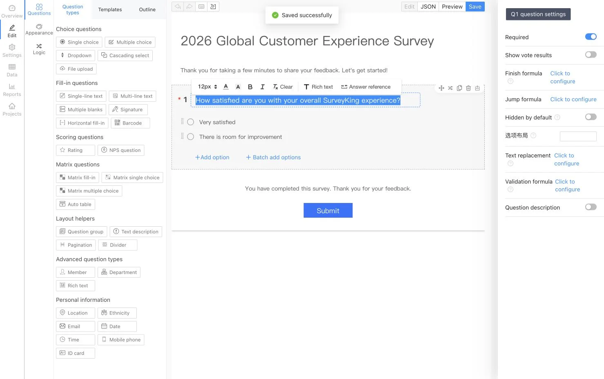
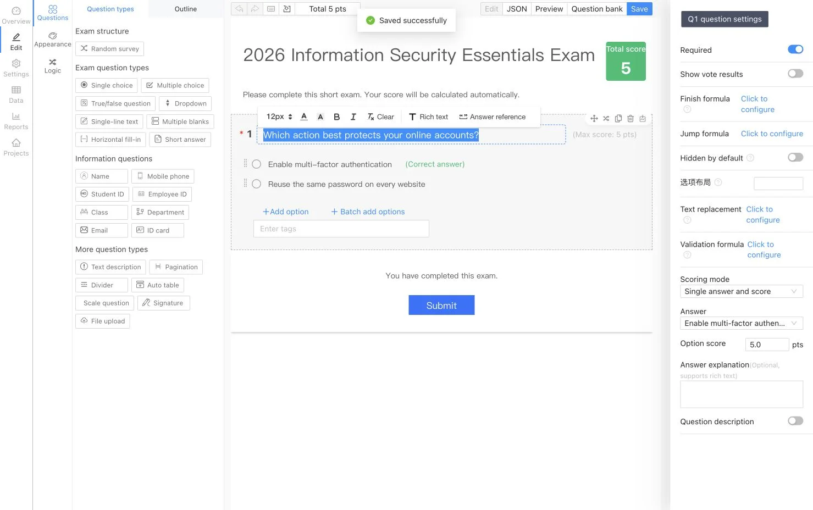

<p align="center">
  
</p>

<h1 align="center">SurveyKing</h1>

<p align="center">
  <strong>Open-source surveys, exams, and question-bank practice—self-hosted on your infrastructure</strong>
</p>

<p align="center">
  Create forms with AI, run automatically graded exams, help learners practice from question banks, and analyze every response in one platform.
</p>

<p align="center">
  <a href="https://github.com/javahuang/SurveyKing/stargazers"></a>
  <a href="https://github.com/javahuang/SurveyKing/network/members"></a>
  
  <a href="./LICENSE"></a>
  <a href="https://hub.docker.com/r/surveyking/surveyking"></a>
</p>

<p align="center">
  <a href="https://surveyking.cn/">Website</a> ·
  <a href="https://s.surveyking.cn/">Live Demo</a> ·
  <a href="https://surveyking.cn/help/quickstart/">Documentation</a> ·
  <a href="https://surveyking.cn/open-source/deploy/">Deployment</a>
</p>

<p align="center">
  English ·
  <a href="./README.zh-CN.md">简体中文</a> ·
  <a href="./README.zh-TW.md">繁體中文</a> ·
  <a href="./README.ja.md">日本語</a> ·
  <a href="./README.ko.md">한국어</a> ·
  <a href="./README.de.md">Deutsch</a> ·
  <a href="./README.fr.md">Français</a> ·
  <a href="./README.th.md">ไทย</a>
</p>

> **Own the workflow and the data.** SurveyKing brings content creation, publishing, responses, grading, practice, analytics, users, and permissions into one deployable system. Start with the embedded H2 database, then move to MySQL when you are ready for production.

## Get running in a minute

Start SurveyKing with Docker and the built-in H2 database:

```bash
docker run -d \
  --name surveyking \
  -p 1991:1991 \
  surveyking/surveyking:latest
```

Open [http://localhost:1991](http://localhost:1991) and sign in:

- Username: `admin`
- Password: `123456`
- Change the default password immediately. The new password must be 8–16 characters and contain uppercase letters, lowercase letters, and digits.

## One platform, three workflows

| Surveys | Exams | Question-bank practice |
| --- | --- | --- |
| Build responsive forms with 20+ question types, conditional logic, themes, and publishing controls | Reuse question banks, configure answers and scores, randomize content, and grade submissions automatically | Offer sequential, random, and incorrect-answer practice with progress tracking on desktop and mobile |
| Create with AI, Excel, plain text, templates, or the visual editor | Analyze scores, answers, rankings, and question-level performance | Add answer explanations, favorites, notes, question flags, and AI-assisted explanations |

## Product tour

> The survey and exam editor screenshots are localized in English. The remaining product screenshots currently show the Simplified Chinese interface. SurveyKing's interface can be switched between English, Simplified Chinese, Traditional Chinese, Japanese, Korean, German, French, and Thai.

### Surveys and response analytics

Design surveys visually, preview them on mobile, publish a respondent-friendly form, and turn collected responses into live reports.

<table>
  <tr>
    <td width="50%" align="center"><a href="docs/readme/locales/en/survey-editor.webp"></a><br /><sub>Visual editor</sub></td>
    <td width="50%" align="center"><a href="docs/readme/survey-mobile-preview.webp"></a><br /><sub>Mobile preview</sub></td>
  </tr>
  <tr>
    <td width="50%" align="center"><a href="docs/readme/survey-answer-ui.webp"></a><br /><sub>Respondent experience</sub></td>
    <td width="50%" align="center"><a href="docs/readme/survey-report.webp"></a><br /><sub>Response analytics</sub></td>
  </tr>
</table>

### Exams and automatic grading

Build exams from reusable question banks, define scoring rules and explanations, randomize questions or options, and review automatically calculated results.

<table>
  <tr>
    <td width="50%" align="center"><a href="docs/readme/locales/en/exam-editor.webp"></a><br /><sub>Exam editor</sub></td>
    <td width="50%" align="center"><a href="docs/readme/exam-mobile-preview.webp"></a><br /><sub>Mobile preview</sub></td>
  </tr>
  <tr>
    <td width="50%" align="center"><a href="docs/readme/exam-answer-ui.webp"></a><br /><sub>Candidate experience</sub></td>
    <td width="50%" align="center"><a href="docs/readme/exam-data.webp"></a><br /><sub>Scores and results</sub></td>
  </tr>
</table>

### Practice on desktop and mobile

Use the same question bank for formal exams and self-directed learning. Learners get instant grading, answer comparison, explanations, favorites, notes, progress, and an incorrect-answer workflow.

<p align="center">
  
  
</p>

### AI-assisted creation

Describe the survey or exam you need in natural language. SurveyKing streams the generated structure into a live preview so you can review it before creating the project.

<p align="center">
  
</p>

## What you can build

| Area | Capabilities |
| --- | --- |
| **Surveys** | Single and multiple choice, dropdowns, cascading choices, text input, matrices, NPS, ratings, signatures, file uploads, QR codes, locations, and more |
| **Logic** | Conditional visibility, branching, calculations, text replacement, validation, dynamic required fields, and automatic option selection |
| **Publishing** | Passwords, allowlists, login requirements, schedules, response limits, public result lookup, and WeChat-based responses |
| **Exams** | Question banks, bulk import, reusable questions, random selection, answer keys, scoring rules, automatic grading, rankings, and result analysis |
| **Practice** | Sequential, random, and incorrect-answer practice; answer cards; flags; favorites; notes; progress; and AI-assisted explanations |
| **Data** | Response editing, search, filters, imports, exports, printing, attachment downloads, and real-time reports |
| **Administration** | Users, roles, departments, positions, organizations, collaboration, and role-based access control (RBAC) |

## AI, integrations, and languages

- Connect OpenAI-compatible APIs and configure available and default models.
- Generate surveys and exams through streaming AI output with a live preview.
- Use Google OAuth, WeChat Open Platform QR login, WeChat Official Account authorization, and account linking.
- Configure Amap for location questions and use built-in H2 or an external MySQL database.
- Switch the application interface among English, Simplified Chinese, Traditional Chinese, Japanese, Korean, German, French, and Thai.

## Deployment options

| Option | Best for | Entry point |
| --- | --- | --- |
| **Docker + H2** | Evaluation and small self-hosted deployments | `surveyking/surveyking:latest` |
| **Docker + MySQL** | Production deployments with an external database | [Deployment guide](https://surveyking.cn/open-source/deploy/) |
| **Windows package** | A quick start without container tooling | [Deployment guide](https://surveyking.cn/open-source/deploy/) |
| **Nginx, BaoTa, or EazyDevelop** | Managed or region-specific deployment workflows | [All deployment options](https://surveyking.cn/open-source/deploy/) |

If Docker Hub is slow in your region, a mirror is available from Alibaba Cloud:

```bash
docker run -d \
  --name surveyking \
  -p 1991:1991 \
  registry.cn-hangzhou.aliyuncs.com/surveyking/surveyking:latest
```

## Technology

| Layer | Technology |
| --- | --- |
| Frontend | React, Ant Design, responsive web UI |
| Backend | Java, Spring Boot 2.7, Spring Security, MyBatis-Plus |
| Databases | H2, MySQL |
| Deployment | Docker, Windows, Nginx, BaoTa, EazyDevelop |

## Documentation and community

- [Quick start](https://surveyking.cn/help/quickstart/)
- [Deployment guide](https://surveyking.cn/open-source/deploy/)
- [AI configuration](https://surveyking.cn/open-source/docs/ai/)
- [Live demo](https://s.surveyking.cn/)
- [GitHub Issues](https://github.com/javahuang/SurveyKing/issues)

Issues and pull requests are welcome. If SurveyKing helps your team, consider starring the repository and sharing how you use it.

### Regional resources

- [Gitee mirror](https://gitee.com/surveyking/surveyking)
- [Complete feature list (Chinese)](https://docs.qq.com/sheet/DZEVveUVMSHpVZkJw)
- QQ community: `980962382`

## License

SurveyKing is open-source software released under the [MIT License](./LICENSE).
