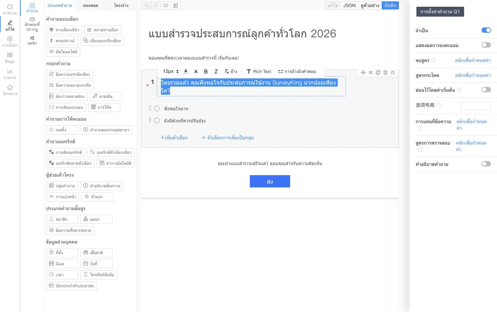
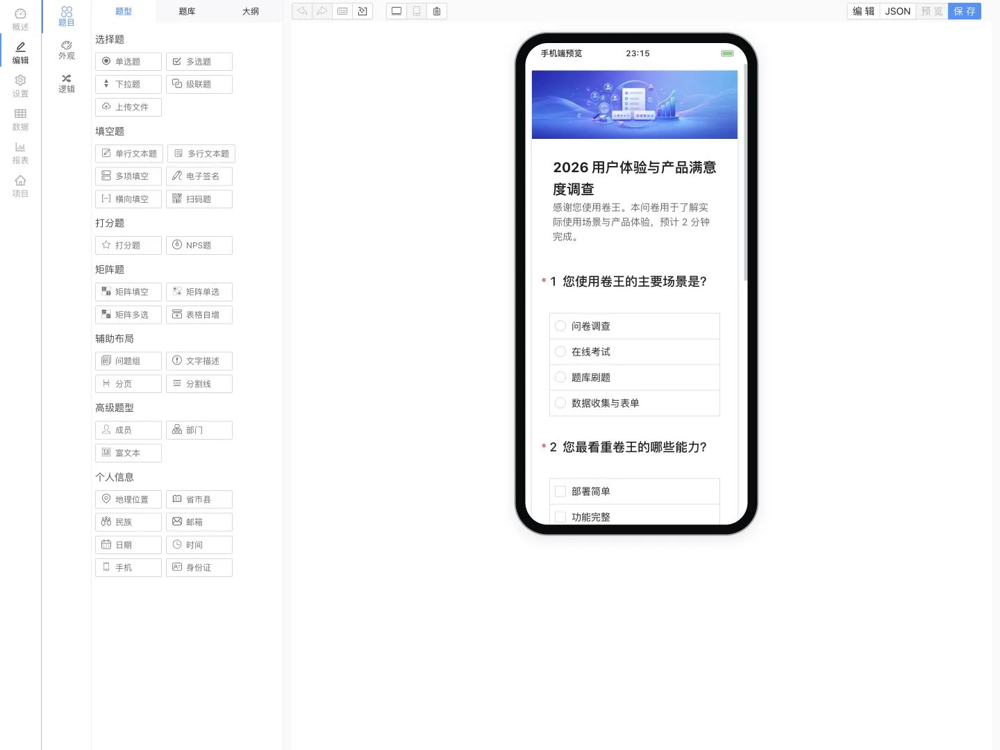
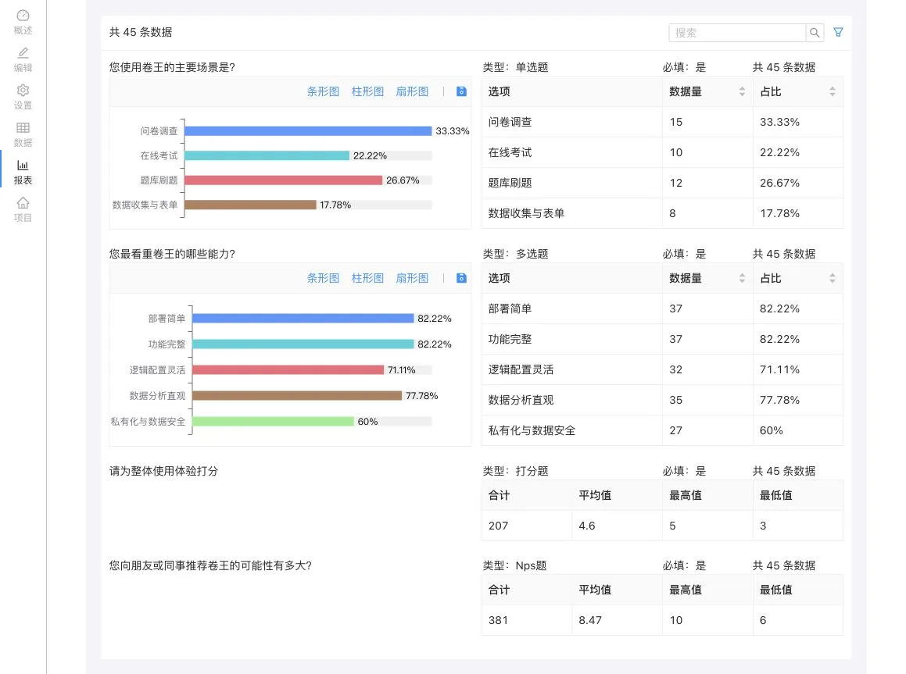
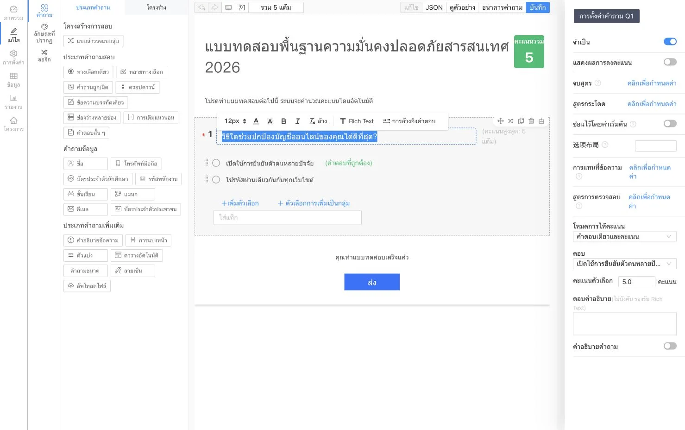
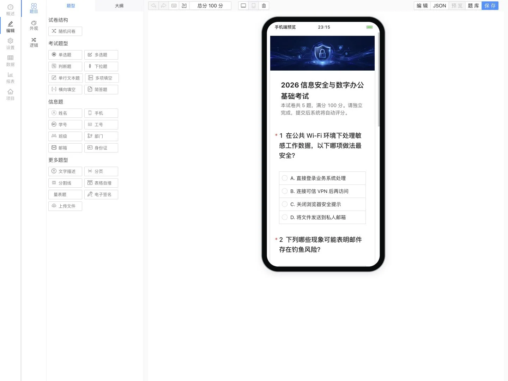
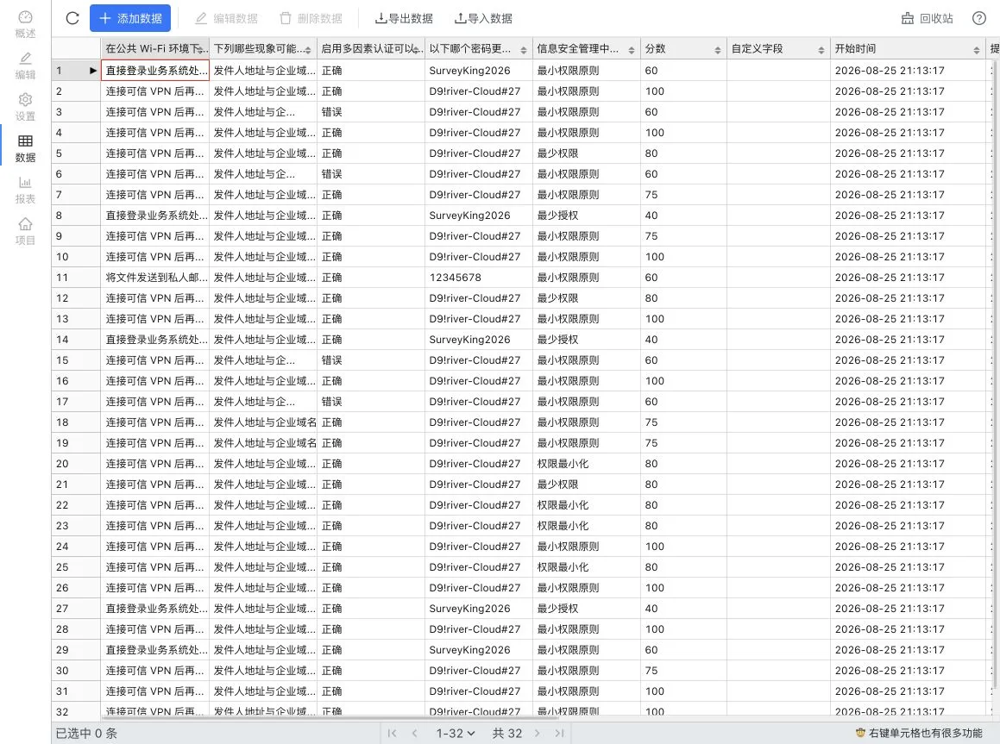
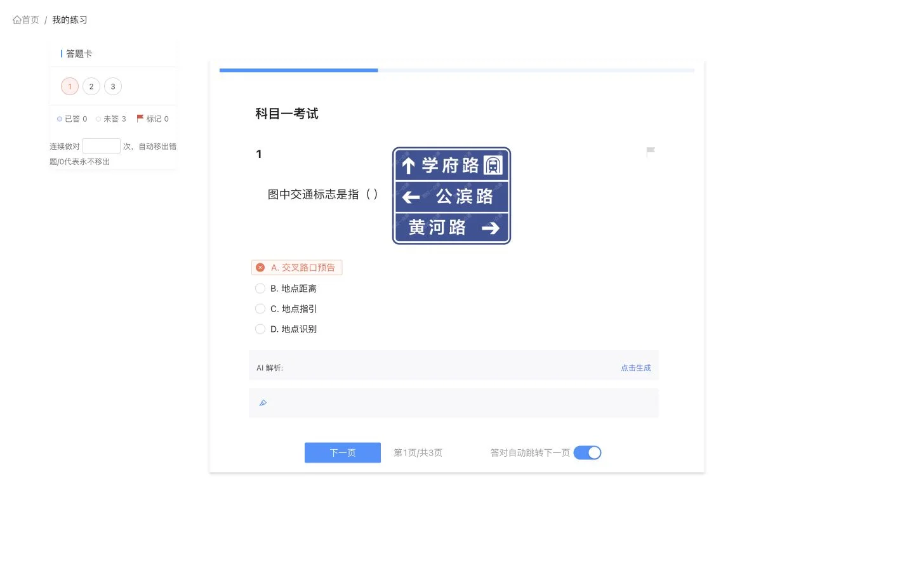
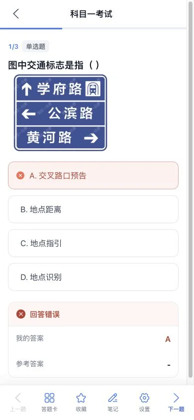
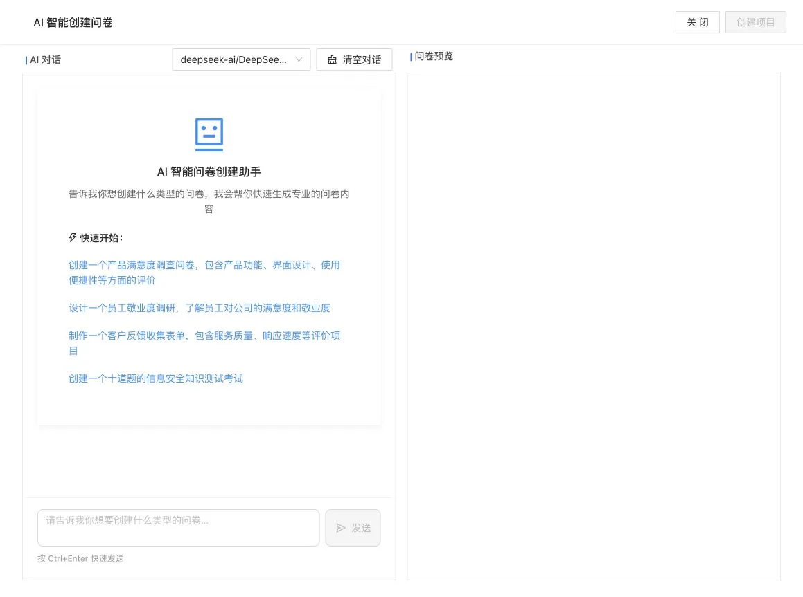

<p align="center">
  
</p>

<h1 align="center">SurveyKing</h1>

<p align="center">
  <strong>แพลตฟอร์มโอเพนซอร์สสำหรับแบบสำรวจ การสอบ และการฝึกทำโจทย์จากคลังข้อสอบ — โฮสต์เองบนโครงสร้างพื้นฐานของคุณ</strong>
</p>

<p align="center">
  สร้างแบบฟอร์มด้วย AI จัดสอบพร้อมตรวจคะแนนอัตโนมัติ ให้ผู้เรียนฝึกทำโจทย์จากคลังข้อสอบ และวิเคราะห์ทุกคำตอบได้ในแพลตฟอร์มเดียว
</p>

<p align="center">
  <a href="https://github.com/javahuang/SurveyKing/stargazers"></a>
  <a href="https://github.com/javahuang/SurveyKing/network/members"></a>
  
  <a href="./LICENSE"></a>
  <a href="https://hub.docker.com/r/surveyking/surveyking"></a>
</p>

<p align="center">
  <a href="https://surveyking.cn/">เว็บไซต์</a> ·
  <a href="https://s.surveyking.cn/">ทดลองใช้งาน</a> ·
  <a href="https://surveyking.cn/help/quickstart/">เอกสารประกอบ</a> ·
  <a href="https://surveyking.cn/open-source/deploy/">การติดตั้งใช้งาน</a>
</p>

<p align="center">
  <a href="./README.md">English</a> ·
  <a href="./README.zh-CN.md">简体中文</a> ·
  <a href="./README.zh-TW.md">繁體中文</a> ·
  <a href="./README.ja.md">日本語</a> ·
  <a href="./README.ko.md">한국어</a> ·
  <a href="./README.de.md">Deutsch</a> ·
  <a href="./README.fr.md">Français</a> ·
  ไทย
</p>

> **ควบคุมทั้งขั้นตอนการทำงานและข้อมูลได้อย่างแท้จริง** SurveyKing รวมการสร้างเนื้อหา การเผยแพร่ การรับคำตอบ การตรวจคะแนน การฝึกทำโจทย์ การวิเคราะห์ ผู้ใช้ และสิทธิ์การเข้าถึงไว้ในระบบเดียวที่พร้อมติดตั้ง เริ่มต้นได้ทันทีด้วยฐานข้อมูล H2 ที่มาพร้อมระบบ แล้วเปลี่ยนไปใช้ MySQL เมื่อพร้อมนำขึ้นใช้งานจริง

## พร้อมใช้งานภายในหนึ่งนาที

เริ่ม SurveyKing ด้วย Docker และฐานข้อมูล H2 ที่มาพร้อมระบบ:

```bash
docker run -d \
  --name surveyking \
  -p 1991:1991 \
  surveyking/surveyking:latest
```

เปิด [http://localhost:1991](http://localhost:1991) แล้วเข้าสู่ระบบด้วยข้อมูลต่อไปนี้:

- ชื่อผู้ใช้: `admin`
- รหัสผ่าน: `123456`
- เปลี่ยนรหัสผ่านเริ่มต้นทันที รหัสผ่านใหม่ต้องมีความยาว 8–16 ตัวอักษร และประกอบด้วยตัวพิมพ์ใหญ่ ตัวพิมพ์เล็ก และตัวเลข

## แพลตฟอร์มเดียว รองรับสามรูปแบบการใช้งาน

| แบบสำรวจ | การสอบ | การฝึกทำโจทย์จากคลังข้อสอบ |
| --- | --- | --- |
| สร้างแบบฟอร์มที่รองรับทุกขนาดหน้าจอด้วยคำถามมากกว่า 20 ประเภท ตรรกะแบบมีเงื่อนไข ธีม และตัวเลือกการเผยแพร่ | นำคลังข้อสอบกลับมาใช้ซ้ำ กำหนดคำตอบและคะแนน สุ่มเนื้อหา และตรวจคะแนนคำตอบโดยอัตโนมัติ | ฝึกทำโจทย์ตามลำดับ แบบสุ่ม หรือเฉพาะข้อที่ตอบผิด พร้อมติดตามความคืบหน้าได้ทั้งบนเดสก์ท็อปและอุปกรณ์เคลื่อนที่ |
| สร้างเนื้อหาด้วย AI, Excel, ข้อความธรรมดา เทมเพลต หรือเครื่องมือแก้ไขแบบภาพ | วิเคราะห์คะแนน คำตอบ อันดับ และผลการทำข้อสอบรายข้อ | เพิ่มคำอธิบายคำตอบ รายการโปรด บันทึกย่อ การปักธงข้อสอบ และคำอธิบายที่สร้างด้วย AI |

## สำรวจผลิตภัณฑ์

> ภาพหน้าจอเครื่องมือแก้ไขแบบสำรวจและข้อสอบได้รับการแปลเป็นภาษาไทยแล้ว ส่วนภาพผลิตภัณฑ์อื่น ๆ ยังแสดงส่วนติดต่อผู้ใช้ภาษาจีนตัวย่อ คุณสามารถสลับภาษาของส่วนติดต่อ SurveyKing ได้ระหว่างภาษาอังกฤษ จีนตัวย่อ จีนตัวเต็ม ญี่ปุ่น เกาหลี เยอรมัน ฝรั่งเศส และไทย

### แบบสำรวจและการวิเคราะห์คำตอบ

ออกแบบแบบสำรวจผ่านเครื่องมือแบบภาพ ดูตัวอย่างบนอุปกรณ์เคลื่อนที่ เผยแพร่แบบฟอร์มที่ใช้งานง่ายสำหรับผู้ตอบ และเปลี่ยนคำตอบที่รวบรวมได้ให้เป็นรายงานแบบเรียลไทม์

<table>
  <tr>
    <td width="50%" align="center"><a href="docs/readme/locales/th/survey-editor.webp"></a><br /><sub>เครื่องมือแก้ไขแบบภาพ</sub></td>
    <td width="50%" align="center"><a href="docs/readme/survey-mobile-preview.webp"></a><br /><sub>ตัวอย่างบนอุปกรณ์เคลื่อนที่</sub></td>
  </tr>
  <tr>
    <td width="50%" align="center"><a href="docs/readme/survey-answer-ui.webp"></a><br /><sub>ประสบการณ์ของผู้ตอบ</sub></td>
    <td width="50%" align="center"><a href="docs/readme/survey-report.webp"></a><br /><sub>การวิเคราะห์คำตอบ</sub></td>
  </tr>
</table>

### การสอบและการตรวจคะแนนอัตโนมัติ

สร้างข้อสอบจากคลังข้อสอบที่นำกลับมาใช้ซ้ำได้ กำหนดเกณฑ์การให้คะแนนและคำอธิบาย สุ่มคำถามหรือตัวเลือก และตรวจสอบผลลัพธ์ที่ระบบคำนวณให้อัตโนมัติ

<table>
  <tr>
    <td width="50%" align="center"><a href="docs/readme/locales/th/exam-editor.webp"></a><br /><sub>เครื่องมือแก้ไขข้อสอบ</sub></td>
    <td width="50%" align="center"><a href="docs/readme/exam-mobile-preview.webp"></a><br /><sub>ตัวอย่างบนอุปกรณ์เคลื่อนที่</sub></td>
  </tr>
  <tr>
    <td width="50%" align="center"><a href="docs/readme/exam-answer-ui.webp"></a><br /><sub>ประสบการณ์ของผู้เข้าสอบ</sub></td>
    <td width="50%" align="center"><a href="docs/readme/exam-data.webp"></a><br /><sub>คะแนนและผลลัพธ์</sub></td>
  </tr>
</table>

### ฝึกทำโจทย์ได้ทั้งบนเดสก์ท็อปและอุปกรณ์เคลื่อนที่

ใช้คลังข้อสอบเดียวกันได้ทั้งในการสอบอย่างเป็นทางการและการเรียนรู้ด้วยตนเอง ผู้เรียนจะทราบผลคะแนนทันที เปรียบเทียบคำตอบ ดูคำอธิบาย เพิ่มรายการโปรดและบันทึกย่อ ติดตามความคืบหน้า และกลับมาทบทวนเฉพาะข้อที่ตอบผิดได้อย่างเป็นระบบ

<p align="center">
  
  
</p>

### การสร้างเนื้อหาด้วย AI

อธิบายแบบสำรวจหรือข้อสอบที่คุณต้องการด้วยภาษาธรรมชาติ SurveyKing จะสตรีมโครงสร้างที่สร้างขึ้นไปยังตัวอย่างแบบเรียลไทม์ เพื่อให้คุณตรวจสอบก่อนสร้างโปรเจกต์จริง

<p align="center">
  
</p>

## สิ่งที่คุณสร้างได้

| หมวด | ความสามารถ |
| --- | --- |
| **แบบสำรวจ** | ตัวเลือกเดียวและหลายตัวเลือก เมนูแบบเลื่อนลง ตัวเลือกแบบลำดับชั้น ช่องกรอกข้อความ เมทริกซ์ NPS การให้คะแนน ลายเซ็น การอัปโหลดไฟล์ คิวอาร์โค้ด ตำแหน่งที่ตั้ง และอื่น ๆ |
| **ตรรกะ** | การแสดงผลแบบมีเงื่อนไข การแตกแขนง การคำนวณ การแทนที่ข้อความ การตรวจสอบความถูกต้อง ช่องบังคับกรอกแบบไดนามิก และการเลือกตัวเลือกอัตโนมัติ |
| **การเผยแพร่** | รหัสผ่าน รายการที่อนุญาต การบังคับเข้าสู่ระบบ กำหนดการ จำนวนคำตอบสูงสุด การค้นหาผลลัพธ์แบบสาธารณะ และการตอบผ่าน WeChat |
| **การสอบ** | คลังข้อสอบ การนำเข้าจำนวนมาก คำถามที่ใช้ซ้ำได้ การสุ่มเลือก เฉลย เกณฑ์การให้คะแนน การตรวจคะแนนอัตโนมัติ การจัดอันดับ และการวิเคราะห์ผลลัพธ์ |
| **การฝึกทำโจทย์** | การฝึกตามลำดับ แบบสุ่ม และเฉพาะข้อที่ตอบผิด; กระดาษคำตอบ; การปักธง; รายการโปรด; บันทึกย่อ; ความคืบหน้า; และคำอธิบายที่สร้างด้วย AI |
| **ข้อมูล** | การแก้ไขคำตอบ การค้นหา ตัวกรอง การนำเข้า การส่งออก การพิมพ์ การดาวน์โหลดไฟล์แนบ และรายงานแบบเรียลไทม์ |
| **การดูแลระบบ** | ผู้ใช้ บทบาท แผนก ตำแหน่ง องค์กร การทำงานร่วมกัน และการควบคุมการเข้าถึงตามบทบาท (RBAC) |

## AI การเชื่อมต่อระบบ และภาษา

- เชื่อมต่อ API ที่เข้ากันได้กับ OpenAI และกำหนดโมเดลที่พร้อมใช้งานรวมถึงโมเดลเริ่มต้น
- สร้างแบบสำรวจและข้อสอบด้วยผลลัพธ์จาก AI แบบสตรีม พร้อมดูตัวอย่างแบบเรียลไทม์
- ใช้ Google OAuth, การเข้าสู่ระบบด้วยคิวอาร์โค้ดผ่าน WeChat Open Platform, การอนุญาตผ่าน WeChat Official Account และการเชื่อมโยงบัญชี
- กำหนดค่า Amap สำหรับคำถามเกี่ยวกับตำแหน่งที่ตั้ง และเลือกใช้ฐานข้อมูล H2 ที่มาพร้อมระบบหรือฐานข้อมูล MySQL ภายนอก
- สลับภาษาของส่วนติดต่อแอปพลิเคชันได้ระหว่างภาษาอังกฤษ จีนตัวย่อ จีนตัวเต็ม ญี่ปุ่น เกาหลี เยอรมัน ฝรั่งเศส และไทย

## ตัวเลือกการติดตั้งใช้งาน

| ตัวเลือก | เหมาะสำหรับ | จุดเริ่มต้น |
| --- | --- | --- |
| **Docker + H2** | การทดลองประเมินและการติดตั้งแบบโฮสต์เองขนาดเล็ก | `surveyking/surveyking:latest` |
| **Docker + MySQL** | การติดตั้งใช้งานจริงร่วมกับฐานข้อมูลภายนอก | [คู่มือการติดตั้งใช้งาน](https://surveyking.cn/open-source/deploy/) |
| **แพ็กเกจ Windows** | เริ่มต้นอย่างรวดเร็วโดยไม่ต้องใช้เครื่องมือคอนเทนเนอร์ | [คู่มือการติดตั้งใช้งาน](https://surveyking.cn/open-source/deploy/) |
| **Nginx, BaoTa หรือ EazyDevelop** | ขั้นตอนการติดตั้งที่มีผู้ดูแลหรือปรับให้เหมาะกับแต่ละภูมิภาค | [ตัวเลือกการติดตั้งทั้งหมด](https://surveyking.cn/open-source/deploy/) |

หาก Docker Hub ทำงานช้าในภูมิภาคของคุณ สามารถใช้อิมเมจมิเรอร์จาก Alibaba Cloud ได้:

```bash
docker run -d \
  --name surveyking \
  -p 1991:1991 \
  registry.cn-hangzhou.aliyuncs.com/surveyking/surveyking:latest
```

## เทคโนโลยี

| ชั้นระบบ | เทคโนโลยี |
| --- | --- |
| ฟรอนต์เอนด์ | React, Ant Design, เว็บอินเทอร์เฟซที่รองรับทุกขนาดหน้าจอ |
| แบ็กเอนด์ | Java, Spring Boot 2.7, Spring Security, MyBatis-Plus |
| ฐานข้อมูล | H2, MySQL |
| การติดตั้งใช้งาน | Docker, Windows, Nginx, BaoTa, EazyDevelop |

## เอกสารประกอบและชุมชน

- [คู่มือเริ่มต้นฉบับย่อ](https://surveyking.cn/help/quickstart/)
- [คู่มือการติดตั้งใช้งาน](https://surveyking.cn/open-source/deploy/)
- [การกำหนดค่า AI](https://surveyking.cn/open-source/docs/ai/)
- [ทดลองใช้งาน](https://s.surveyking.cn/)
- [GitHub Issues](https://github.com/javahuang/SurveyKing/issues)

ยินดีต้อนรับ Issues และ Pull Requests หาก SurveyKing เป็นประโยชน์กับทีมของคุณ โปรดกดดาวให้รีโพซิทอรีและแบ่งปันว่าคุณนำแพลตฟอร์มไปใช้งานอย่างไร

### แหล่งข้อมูลสำหรับแต่ละภูมิภาค

- [มิเรอร์บน Gitee](https://gitee.com/surveyking/surveyking)
- [รายการฟีเจอร์ทั้งหมด (ภาษาจีน)](https://docs.qq.com/sheet/DZEVveUVMSHpVZkJw)
- ชุมชน QQ: `980962382`

## สัญญาอนุญาต

SurveyKing เป็นซอฟต์แวร์โอเพนซอร์สที่เผยแพร่ภายใต้ [สัญญาอนุญาต MIT](./LICENSE)
