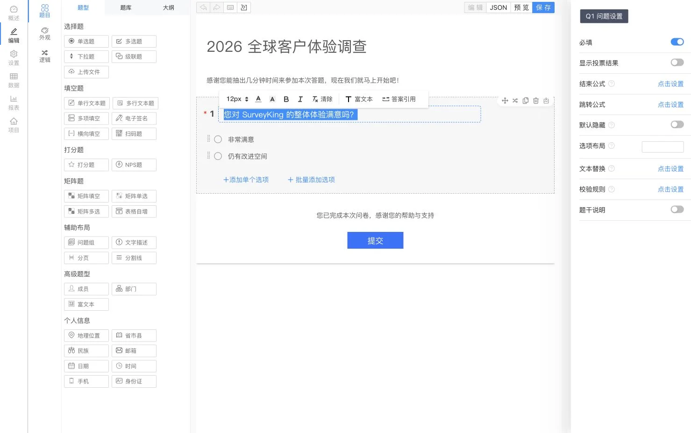
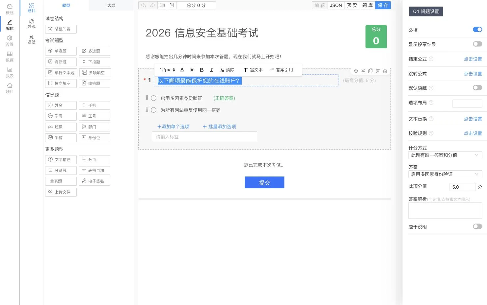

<p align="center">
  
</p>

<h1 align="center">SurveyKing</h1>

<p align="center">
  <strong>开源问卷、考试与题库练习——部署在您自己的基础设施上</strong>
</p>

<p align="center">
  在一个平台中用 AI 创建表单、组织自动判分的考试、帮助学习者进行题库练习，并分析每一份答卷。
</p>

<p align="center">
  <a href="https://github.com/javahuang/SurveyKing/stargazers"></a>
  <a href="https://github.com/javahuang/SurveyKing/network/members"></a>
  
  <a href="./LICENSE"></a>
  <a href="https://hub.docker.com/r/surveyking/surveyking"></a>
</p>

<p align="center">
  <a href="https://surveyking.cn/">官方网站</a> ·
  <a href="https://s.surveyking.cn/">在线演示</a> ·
  <a href="https://surveyking.cn/help/quickstart/">文档</a> ·
  <a href="https://surveyking.cn/open-source/deploy/">部署指南</a>
</p>

<p align="center">
  <a href="./README.md">English</a> ·
  简体中文 ·
  <a href="./README.zh-TW.md">繁體中文</a> ·
  <a href="./README.ja.md">日本語</a> ·
  <a href="./README.ko.md">한국어</a> ·
  <a href="./README.de.md">Deutsch</a> ·
  <a href="./README.fr.md">Français</a> ·
  <a href="./README.th.md">ไทย</a>
</p>

> **自主掌控工作流与数据。** SurveyKing 将内容创建、发布、答卷收集、判分、练习、数据分析、用户与权限整合到一套可部署的系统中。您可以先使用内置 H2 数据库，需要投入生产环境时再迁移至 MySQL。

## 一分钟启动

使用 Docker 和内置 H2 数据库启动 SurveyKing：

```bash
docker run -d \
  --name surveyking \
  -p 1991:1991 \
  surveyking/surveyking:latest
```

打开 [http://localhost:1991](http://localhost:1991) 并登录：

- 用户名：`admin`
- 密码：`123456`
- 请立即修改默认密码。新密码须为 8–16 个字符，并同时包含大写字母、小写字母和数字。

## 一个平台，三种工作流

| 问卷 | 考试 | 题库练习 |
| --- | --- | --- |
| 使用 20 多种题型、条件逻辑、主题和发布控制，构建响应式表单 | 复用题库，配置答案与分值，随机生成内容，并自动判分 | 在桌面端和移动端提供顺序练习、随机练习和错题练习，并跟踪学习进度 |
| 通过 AI、Excel、纯文本、模板或可视化编辑器创建内容 | 分析成绩、答案、排名和逐题表现 | 提供答案解析、收藏、笔记、题目标记和 AI 辅助解析 |

## 产品导览

> 以下问卷与考试编辑器截图使用简体中文界面，其余产品截图同样保留简体中文。SurveyKing 的界面可切换为英文、简体中文、繁体中文、日语、韩语、德语、法语和泰语。

### 问卷与答卷分析

可视化设计问卷，在移动端预览，发布对答题者友好的表单，并将回收数据转化为实时报告。

<table>
  <tr>
    <td width="50%" align="center"><a href="docs/readme/locales/zh-CN/survey-editor.webp"></a><br /><sub>可视化编辑器</sub></td>
    <td width="50%" align="center"><a href="docs/readme/survey-mobile-preview.webp"></a><br /><sub>移动端预览</sub></td>
  </tr>
  <tr>
    <td width="50%" align="center"><a href="docs/readme/survey-answer-ui.webp"></a><br /><sub>答题体验</sub></td>
    <td width="50%" align="center"><a href="docs/readme/survey-report.webp"></a><br /><sub>答卷分析</sub></td>
  </tr>
</table>

### 考试与自动判分

利用可复用题库创建考试，定义计分规则和答案解析，随机抽题或打乱选项，并查看系统自动计算的考试结果。

<table>
  <tr>
    <td width="50%" align="center"><a href="docs/readme/locales/zh-CN/exam-editor.webp"></a><br /><sub>考试编辑器</sub></td>
    <td width="50%" align="center"><a href="docs/readme/exam-mobile-preview.webp"></a><br /><sub>移动端预览</sub></td>
  </tr>
  <tr>
    <td width="50%" align="center"><a href="docs/readme/exam-answer-ui.webp"></a><br /><sub>考生体验</sub></td>
    <td width="50%" align="center"><a href="docs/readme/exam-data.webp"></a><br /><sub>成绩与结果</sub></td>
  </tr>
</table>

### 桌面端与移动端练习

同一套题库既可用于正式考试，也可用于自主学习。学习者可以即时获得判分结果，对照答案、查看解析、收藏题目、记录笔记、跟踪进度，并通过错题练习巩固知识。

<p align="center">
  
  
</p>

### AI 辅助创建

用自然语言描述您需要的问卷或考试。SurveyKing 会以流式方式将生成的结构呈现在实时预览中，供您确认后再创建项目。

<p align="center">
  
</p>

## 可以构建什么

| 领域 | 功能 |
| --- | --- |
| **问卷** | 单选、多选、下拉选择、级联选择、文本输入、矩阵、NPS、评分、签名、文件上传、二维码、地理位置等 |
| **逻辑** | 条件显示、分支跳转、计算、文本替换、校验、动态必填和选项自动选择 |
| **发布** | 密码、白名单、登录要求、开放时间、答卷数量限制、公开结果查询和微信答题 |
| **考试** | 题库、批量导入、题目复用、随机抽题、答案、计分规则、自动判分、排名和结果分析 |
| **练习** | 顺序练习、随机练习和错题练习；答题卡、标记、收藏、笔记、进度和 AI 辅助解析 |
| **数据** | 答卷编辑、搜索、筛选、导入、导出、打印、附件下载和实时报告 |
| **管理** | 用户、角色、部门、职务、组织、协作和基于角色的访问控制（RBAC） |

## AI、集成与语言

- 连接 OpenAI 兼容 API，并配置可用模型和默认模型。
- 通过流式 AI 输出生成问卷与考试，并实时预览。
- 支持 Google OAuth、微信开放平台扫码登录、微信公众号授权和账号绑定。
- 为地理位置题配置高德地图，并选择内置 H2 或外部 MySQL 数据库。
- 应用界面可在英文、简体中文、繁体中文、日语、韩语、德语、法语和泰语之间切换。

## 部署方式

| 方式 | 适用场景 | 入口 |
| --- | --- | --- |
| **Docker + H2** | 评估体验和小规模自托管部署 | `surveyking/surveyking:latest` |
| **Docker + MySQL** | 使用外部数据库的生产部署 | [部署指南](https://surveyking.cn/open-source/deploy/) |
| **Windows 安装包** | 无需容器工具即可快速启动 | [部署指南](https://surveyking.cn/open-source/deploy/) |
| **Nginx、BaoTa 或 EazyDevelop** | 受管或区域化部署流程 | [所有部署方式](https://surveyking.cn/open-source/deploy/) |

如果您所在地区访问 Docker Hub 较慢，可以使用阿里云镜像：

```bash
docker run -d \
  --name surveyking \
  -p 1991:1991 \
  registry.cn-hangzhou.aliyuncs.com/surveyking/surveyking:latest
```

## 技术栈

| 层级 | 技术 |
| --- | --- |
| 前端 | React、Ant Design、响应式 Web UI |
| 后端 | Java、Spring Boot 2.7、Spring Security、MyBatis-Plus |
| 数据库 | H2、MySQL |
| 部署 | Docker、Windows、Nginx、BaoTa、EazyDevelop |

## 文档与社区

- [快速开始](https://surveyking.cn/help/quickstart/)
- [部署指南](https://surveyking.cn/open-source/deploy/)
- [AI 配置](https://surveyking.cn/open-source/docs/ai/)
- [在线演示](https://s.surveyking.cn/)
- [GitHub Issues](https://github.com/javahuang/SurveyKing/issues)

欢迎提交 Issue 和 Pull Request。如果 SurveyKing 对您的团队有所帮助，欢迎为项目加 Star，并分享您的使用方式。

### 地区资源

- [Gitee 镜像](https://gitee.com/surveyking/surveyking)
- [完整功能列表（中文）](https://docs.qq.com/sheet/DZEVveUVMSHpVZkJw)
- QQ 交流群：`980962382`

## 许可证

SurveyKing 是依据 [MIT 许可证](./LICENSE) 发布的开源软件。
