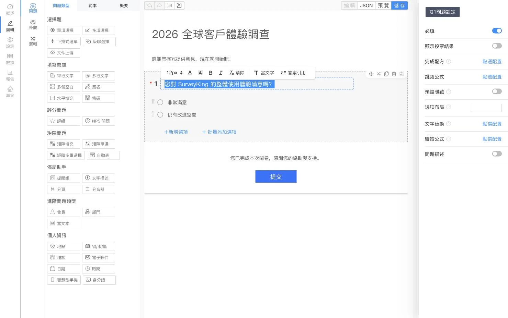
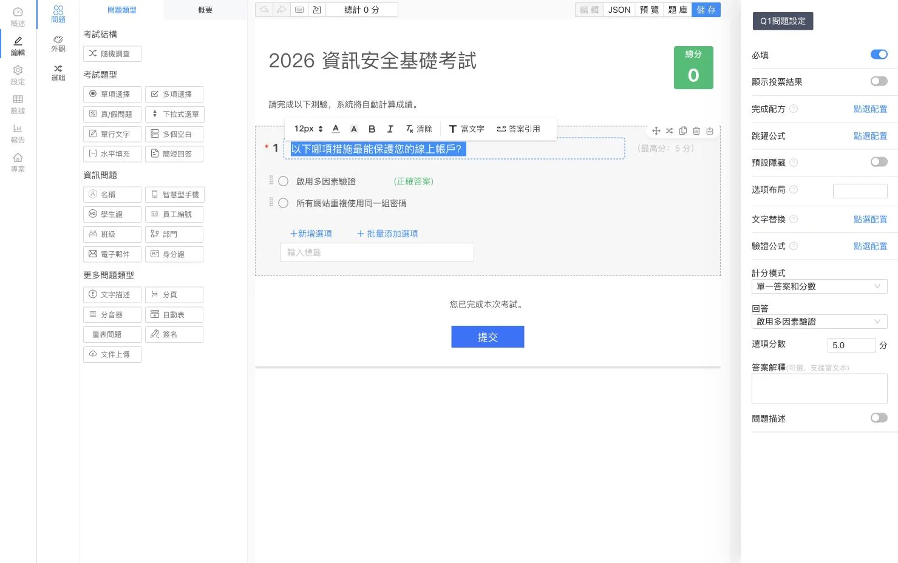

<p align="center">
  
</p>

<h1 align="center">SurveyKing</h1>

<p align="center">
  <strong>開源問卷、考試與題庫練習——部署於您的自有基礎架構</strong>
</p>

<p align="center">
  在同一套平台中運用 AI 建立表單、舉辦自動評分的考試、協助學習者進行題庫練習，並分析每一份回覆。
</p>

<p align="center">
  <a href="https://github.com/javahuang/SurveyKing/stargazers"></a>
  <a href="https://github.com/javahuang/SurveyKing/network/members"></a>
  
  <a href="./LICENSE"></a>
  <a href="https://hub.docker.com/r/surveyking/surveyking"></a>
</p>

<p align="center">
  <a href="https://surveyking.cn/">官方網站</a> ·
  <a href="https://s.surveyking.cn/">線上展示</a> ·
  <a href="https://surveyking.cn/help/quickstart/">文件</a> ·
  <a href="https://surveyking.cn/open-source/deploy/">部署指南</a>
</p>

<p align="center">
  <a href="./README.md">English</a> ·
  <a href="./README.zh-CN.md">简体中文</a> ·
  繁體中文 ·
  <a href="./README.ja.md">日本語</a> ·
  <a href="./README.ko.md">한국어</a> ·
  <a href="./README.de.md">Deutsch</a> ·
  <a href="./README.fr.md">Français</a> ·
  <a href="./README.th.md">ไทย</a>
</p>

> **工作流程與資料，全由您掌控。** SurveyKing 將內容建立、發佈、回覆收集、評分、練習、資料分析、使用者及權限整合在一套可部署的系統中。您可以先使用內建 H2 資料庫，準備導入正式環境時再移轉至 MySQL。

## 一分鐘快速啟動

使用 Docker 與內建 H2 資料庫啟動 SurveyKing：

```bash
docker run -d \
  --name surveyking \
  -p 1991:1991 \
  surveyking/surveyking:latest
```

開啟 [http://localhost:1991](http://localhost:1991) 並登入：

- 使用者名稱：`admin`
- 密碼：`123456`
- 請立即變更預設密碼。新密碼須為 8–16 個字元，並同時包含大寫字母、小寫字母及數字。

## 一套平台，三種工作流程

| 問卷 | 考試 | 題庫練習 |
| --- | --- | --- |
| 運用 20 多種題型、條件邏輯、主題及發佈控制，建立響應式表單 | 重複運用題庫，設定答案與配分、隨機安排內容，並自動評分 | 在桌面與行動裝置上提供循序、隨機及錯題練習，並追蹤學習進度 |
| 透過 AI、Excel、純文字、範本或視覺化編輯器建立內容 | 分析分數、答案、排名及各題作答表現 | 提供答案解析、收藏、筆記、題目標記及 AI 輔助解析 |

## 產品導覽

> 問卷與考試編輯器截圖已使用繁體中文；其餘產品截圖目前仍顯示簡體中文介面。SurveyKing 介面可切換為英文、簡體中文、繁體中文、日文、韓文、德文、法文及泰文。

### 問卷與回覆分析

以視覺化方式設計問卷、在行動裝置上預覽、發佈方便填答的表單，並將回收資料轉化為即時報表。

<table>
  <tr>
    <td width="50%" align="center"><a href="docs/readme/locales/zh-TW/survey-editor.webp"></a><br /><sub>視覺化編輯器</sub></td>
    <td width="50%" align="center"><a href="docs/readme/survey-mobile-preview.webp"></a><br /><sub>行動版預覽</sub></td>
  </tr>
  <tr>
    <td width="50%" align="center"><a href="docs/readme/survey-answer-ui.webp"></a><br /><sub>填答體驗</sub></td>
    <td width="50%" align="center"><a href="docs/readme/survey-report.webp"></a><br /><sub>回覆分析</sub></td>
  </tr>
</table>

### 考試與自動評分

運用可重複使用的題庫建立考試，設定評分規則與答案解析，隨機抽題或打亂選項，並檢視系統自動計算的結果。

<table>
  <tr>
    <td width="50%" align="center"><a href="docs/readme/locales/zh-TW/exam-editor.webp"></a><br /><sub>考試編輯器</sub></td>
    <td width="50%" align="center"><a href="docs/readme/exam-mobile-preview.webp"></a><br /><sub>行動版預覽</sub></td>
  </tr>
  <tr>
    <td width="50%" align="center"><a href="docs/readme/exam-answer-ui.webp"></a><br /><sub>考生體驗</sub></td>
    <td width="50%" align="center"><a href="docs/readme/exam-data.webp"></a><br /><sub>分數與結果</sub></td>
  </tr>
</table>

### 在桌面與行動裝置上練習

同一套題庫既能用於正式考試，也能用於自主學習。學習者可立即取得評分結果、對照答案、查看解析、收藏題目、記錄筆記、追蹤進度，並透過錯題練習加強學習。

<p align="center">
  
  
</p>

### AI 輔助建立

使用自然語言描述您需要的問卷或考試。SurveyKing 會以串流方式將產生的結構呈現在即時預覽中，讓您確認後再建立專案。

<p align="center">
  
</p>

## 您可以打造什麼

| 領域 | 功能 |
| --- | --- |
| **問卷** | 單選、複選、下拉選單、連動選項、文字輸入、矩陣題、NPS、評分、簽名、檔案上傳、QR Code、位置資訊等 |
| **邏輯** | 條件式顯示、分支跳轉、計算、文字取代、驗證、動態必填及自動選取選項 |
| **發佈** | 密碼、允許名單、登入要求、開放時段、回覆數量限制、公開查詢結果及透過微信填答 |
| **考試** | 題庫、批次匯入、題目重複使用、隨機抽題、標準答案、評分規則、自動評分、排名及結果分析 |
| **練習** | 循序、隨機及錯題練習；答案卡、標記、收藏、筆記、進度及 AI 輔助解析 |
| **資料** | 回覆編輯、搜尋、篩選、匯入、匯出、列印、附件下載及即時報表 |
| **管理** | 使用者、角色、部門、職位、組織、協作及角色型存取控制（RBAC） |

## AI、整合與語言

- 連接 OpenAI 相容 API，並設定可用模型與預設模型。
- 透過串流 AI 輸出產生問卷與考試，並即時預覽。
- 支援 Google OAuth、微信開放平台 QR Code 登入、微信公眾號授權及帳號連結。
- 為位置題設定高德地圖，並使用內建 H2 或外部 MySQL 資料庫。
- 應用程式介面可在英文、簡體中文、繁體中文、日文、韓文、德文、法文及泰文之間切換。

## 部署方式

| 方式 | 適用情境 | 入口 |
| --- | --- | --- |
| **Docker + H2** | 評估及小型自行託管部署 | `surveyking/surveyking:latest` |
| **Docker + MySQL** | 搭配外部資料庫的正式環境部署 | [部署指南](https://surveyking.cn/open-source/deploy/) |
| **Windows 套件** | 不使用容器工具也能快速啟動 | [部署指南](https://surveyking.cn/open-source/deploy/) |
| **Nginx、BaoTa 或 EazyDevelop** | 受管或區域化部署流程 | [所有部署方式](https://surveyking.cn/open-source/deploy/) |

如果您所在地區存取 Docker Hub 的速度較慢，可改用阿里雲映像：

```bash
docker run -d \
  --name surveyking \
  -p 1991:1991 \
  registry.cn-hangzhou.aliyuncs.com/surveyking/surveyking:latest
```

## 技術架構

| 層級 | 技術 |
| --- | --- |
| 前端 | React、Ant Design、響應式 Web UI |
| 後端 | Java、Spring Boot 2.7、Spring Security、MyBatis-Plus |
| 資料庫 | H2、MySQL |
| 部署 | Docker、Windows、Nginx、BaoTa、EazyDevelop |

## 文件與社群

- [快速入門](https://surveyking.cn/help/quickstart/)
- [部署指南](https://surveyking.cn/open-source/deploy/)
- [AI 設定](https://surveyking.cn/open-source/docs/ai/)
- [線上展示](https://s.surveyking.cn/)
- [GitHub Issues](https://github.com/javahuang/SurveyKing/issues)

歡迎提交 Issue 和 Pull Request。如果 SurveyKing 對您的團隊有所幫助，歡迎為專案加上 Star，並分享您的使用方式。

### 地區資源

- [Gitee 鏡像](https://gitee.com/surveyking/surveyking)
- [完整功能清單（中文）](https://docs.qq.com/sheet/DZEVveUVMSHpVZkJw)
- QQ 社群：`980962382`

## 授權條款

SurveyKing 是依據 [MIT 授權條款](./LICENSE) 發佈的開源軟體。
